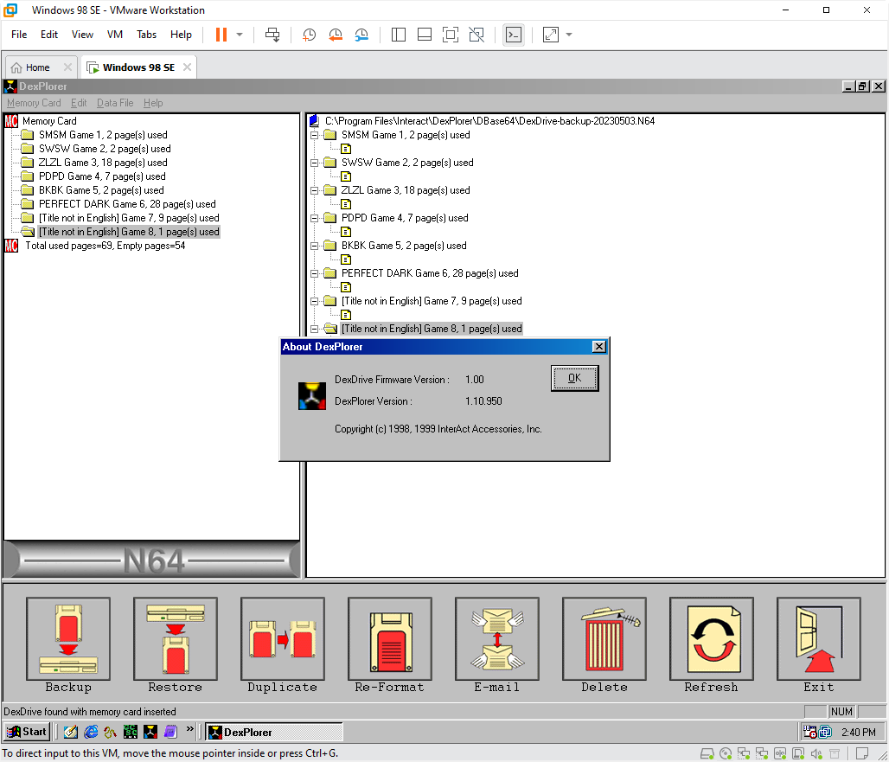
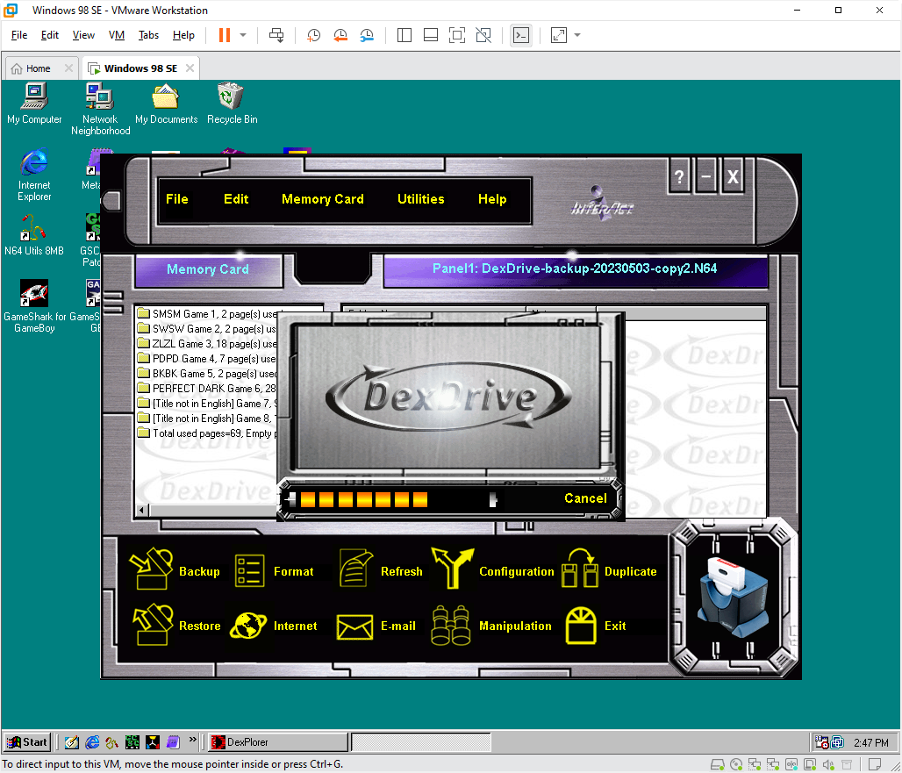

# SharkDumps

This repository aims to preserve all known information about retro video game enhancers from the 1990s-2000s:
GameShark, Action Replay, Xplorer 64, Code Breaker, Game Genie, DexDrive, TV Tuners, etc.
Specifically, we document: firmware dumps, PCB schematics, software utilities, instruction manuals,
cartridge designs, box art, and more.

We welcome contributions! If you have firmware, schematics, photos, etc. that are not yet documented here,
please create a pull request or email cheatobaggins@gmail.com or rweick@gmail.com! 😀

---

## Nintendo 64

### GameShark / GameShark Pro

👉 [More information about the N64 GameShark / GameShark Pro](/n64-gameshark.md) 👈

Visual TL;DR:

  
  
  
  

  
  
  
  

  
  
  
  

  
  
  
  

[Learn more about the N64 GameShark / GameShark Pro!](/n64-gameshark.md)

   

### Action Replay / Action Replay Pro

👉 [More information about the N64 Action Replay / Action Replay Pro](/n64-actionreplay.md) 👈

Visual TL;DR:

  
  
  
  

[Learn more about the N64 Action Replay / Action Replay Pro!](/n64-actionreplay.md)

   

### Equalizer

👉 [More information about the N64 Equalizer!](/n64-equalizer.md) 👈

Visual TL;DR:

  
  

  
  

[Learn more about the N64 Equalizer!](/n64-equalizer.md)

   

### Game Buster

👉 [More information about the N64 Game Buster](/n64-gamebuster.md) 👈

Visual TL;DR:

  
  

  
  

[Learn more about the N64 Game Buster!](/n64-gamebuster.md)

   

### Xplorer 64

👉 [More information about the N64 Xplorer 64](/n64-xplorer.md) 👈

Visual TL;DR:

  
  
  
  

  
  
  
  

  
  
  
  

[Learn more about the N64 Xplorer 64!](/n64-xplorer.md)

   

### GB Hunter

👉 [More information about the N64 GB Hunter](/n64-gbhunter.md) 👈

Visual TL;DR:

  
  
  

  
  
  
  

[Learn more about the N64 GB Hunter!](/n64-gbhunter.md)

   

### Game Booster

👉 [More information about the N64 Game Booster](/n64-gamebooster.md) 👈

Visual TL;DR:

  
  

  
  
  
  

[Learn more about the N64 Game Booster!](/n64-gamebooster.md)

   

### DexDrive

👉 [More information about the N64 DexDrive](/n64-dexdrive.md) 👈

Visual TL;DR:

[Learn more about the N64 DexDrive!](/n64-dexdrive.md)

   

---

## PC

### GameShark v1.1 for Windows 95/98

👉 [More information about PC GameShark v1.1 for Windows 95/98](/pc-gameshark-v1.1.md) 👈

Visual TL;DR:

  
  
  
  

  
  
  

  
  

  
  

[Learn more about PC GameShark v1.1 for Windows 95/98!](/pc-gameshark-v1.1.md)

   

### GameShark v3.0 for Windows 98/ME

👉 [More information about PC GameShark v3.0 for Windows 98/ME](/pc-gameshark-v3.0.md) 👈

Visual TL;DR:

  
  
  
  

  
  
  

  
  
  

[Learn more about PC GameShark v3.0 for Windows 98/ME!](/pc-gameshark-v3.0.md)

   

---

["Game Boy Cheat Devices - History & Use" on YouTube](https://www.youtube.com/watch?v=NJZ3keMXKH4)

---

## GB GameShark (NA)

For Game Boy (DMG), Game Boy Pocket (GBP), Game Boy Color (GBC), and Game Boy Advance (GBA).

- GameShark for Game Boy Pocket & Color • [PDF (original)](/gb/manuals/gb_gameshark.pdf)

---

## GB Pro Action Replay (EU)

[Source](https://www.fullyretro.com/product/game-boy-original-pro-action-replay-cheat-cartridge,52233905) ([Archive](https://web.archive.org/web/20211105072549/https://www.fullyretro.com/product/game-boy-original-pro-action-replay-cheat-cartridge,52233905))

---

## GB Action Replay Professional (EU)

[Source](https://www.fullyretro.com/product/game-boy-original-action-replay-professional-cheat-cartridge,45859158) ([Archive](https://web.archive.org/web/20211121003658/https://www.fullyretro.com/product/game-boy-original-action-replay-professional-cheat-cartridge,45859158))

---

## GBC Action Replay Pro (EU)

[Source](https://www.fullyretro.com/product/game-boy-color-action-replay-pro-cheat-cartridge,89319444) ([Archive](https://web.archive.org/web/20211114003955/https://www.fullyretro.com/product/game-boy-color-action-replay-pro-cheat-cartridge,89319444))

---

## GBC Blaze Xploder (EU)

[Source](https://www.fullyretro.com/product/game-boy-blaze-xploder-cheat-cartridge,79882270) ([Archive](https://web.archive.org/web/20211119155537/https://www.fullyretro.com/product/game-boy-blaze-xploder-cheat-cartridge,79882270))

Compatible with Game Boy Color and regular Game Boy (DMG) games.

The Xploder GB (aka Xplorer GB) has an in-game trainer (cheat code finder) as well as the ability to transfer cheats and upgrade the firmware over an EXT link cable or infrared (IR).

### GBC Blaze Xploder firmware

_Dumped by @RWeick_

To view the contents of the ROM dumps, use our [Xploder GB ROM hexpattern](/hexpats/patterns/imhex-gbc-xploder-rom-pattern.hexpat) for the [ImHex editor](https://imhex.werwolv.net/).

| Filename                                   | Version   | Build timestamp            |  #G |  #C | Clean? |
|:------------------------------------------ |:--------- |:-------------------------- | ---:| ---:|:------:|
| [`gbc-xploder-vX.XX-xxxxxxxx-dirty.bin`][] | _Unknown_ | _Unknown_                  | 210 | 447 | ⚠️      |

[`gbc-xploder-vX.XX-xxxxxxxx-dirty.bin`]: /gb/firmware/gbc-xploder-vX.XX-xxxxxxxx-dirty.bin

EEPROM: `SST29EE020` `PLCC32`

---

## GB Blaze Xploder Lite (EU)

[Source](https://www.fullyretro.com/product/game-boy-blaze-xploder-lite-cheat-cartridge,15306699) ([Archive](https://web.archive.org/web/20211124124624/https://www.fullyretro.com/product/game-boy-blaze-xploder-lite-cheat-cartridge,15306699))

---

## GB Action Replay Xtreme (EU)

> Game Boy Action Replay Xtreme Cheat Cartridge Special Edition - Game Boy
>
> Cheat Cartridge for Game Boy. Includes codes for Pokemon Red, Blue, Yelow, Gold, Silver, Crystal, Pinball and the Trading Card game. In total, the Action Replay Extreme Special Edition has codes for 317 games, with more codes able to be added for other games.

[Source](https://www.fullyretro.com/product/game-boy-action-replay-xtreme-cheat-cartridge-special-edition,97887158) ([Archive](https://web.archive.org/web/20211113065947/https://www.fullyretro.com/product/game-boy-action-replay-xtreme-cheat-cartridge-special-edition,97887158))

---

## GBA Blaze Xploder Advance

[Source](https://www.fullyretro.com/product/game-boy-advance-blaze-xploder-advance-cheat-cartridge,74818826) ([Archive](https://web.archive.org/web/20170610195644/https://www.fullyretro.com/product/game-boy-advance-blaze-xploder-advance-cheat-cartridge,74818826))

---

## GB Shark MX

_Dumped by @RWeick_

To view the contents of the ROM dumps, use our [GB Shark MX ROM hexpattern](/hexpats/patterns/imhex-gb-shark-mx-rom-pattern.hexpat) for the [ImHex editor](https://imhex.werwolv.net/).

| Filename                                  | Version | Build date | Flash chip         | Clean? |
|:----------------------------------------- |:------- |:---------- |:------------------ |:------:|
| [`gb-shark-mx-v1.02-2000-pristine.bin`][] | `v1.02` | `2000`     | `SST39SF020PLCC32` | ⭐️ |

[`gb-shark-mx-v1.02-2000-pristine.bin`]: /gb/firmware/gb-shark-mx-v1.02-2000-pristine.bin

From https://gameshark-mx.blogspot.com/:

> **Working Registration Codes:**
>
> - `SHGGGGGGGGGGGGGQ`
> - `WTU69SSN6INIEFNP`
> - `EPR6NNC4XB5YIDND`
> - `ZIQD79DTJG58W875`
> - `S5V5KI686BHFH5HJ`
> - `7K5TBICAGSZSN4U9`

More information:

- [IGN product review (2000-09-14)](https://www.ign.com/articles/2000/09/15/shark-mx)
- [NesDev forum post (2012-11-25)](https://forums.nesdev.org/viewtopic.php?t=9520)
- [Shark MX overview](https://web.archive.org/web/20140416175758/www.bennvenn.com/mx.html)
- [Datel MBC1 chip documentation](https://web.archive.org/web/20140416180028/http://www.bennvenn.com/Datel_MBC1.htm)
- [Re-Programming the Shark MX](https://web.archive.org/web/20140416180029/http://bennvenn.com/Reprogramming_the_Shark_MX.htm)
- [Technical details, chip datasheets, and software](https://web.archive.org/web/20140416175937/http://www.oocities.org/grinara/)

---

## GB Mega Memory Card

For Game Boy and Game Boy Color.

- Mega Memory Card manual • [PDF (original)](/gb/manuals/gb_mega_memory.pdf)

---

## GBA TV Tuners

_Dumped by @RWeick and @felixjones_

| Filename                                          | Version | Build date | Region      | Flash chip           | Clean? |
|:------------------------------------------------- |:------- |:---------- |:----------- |:-------------------- |:------:|
| [`gba-pelican-tv-tuner-MBM29LV400TCTSOP48.bin`][] | ?       | ?          | NTSC-M (US) | `MBM29LV400TCTSOP48` | ? |
| [`gba-blaze-tv-tuner-tvap-0.7z`]                  | ?       | ?          | PAL-? (EU)  | ?                    | ? |

[`gba-pelican-tv-tuner-MBM29LV400TCTSOP48.bin`]: /gb/firmware/gba-pelican-tv-tuner-MBM29LV400TCTSOP48.bin
[`gba-blaze-tv-tuner-tvap-0.7z`]:                /gb/firmware/gba-blaze-tv-tuner-tvap-0.7z

More information:

- [Pelican TV Tuner article from the Nintendo Fandom wiki](https://nintendo.fandom.com/wiki/Pelican_TV_Tuner)
- [Blaze TV Tuner dump: tweet from @felixjones on Twitter](https://twitter.com/Xilefian/status/1626322091141218306)
- [Blaze TV Tuner dump: file from @felixjones on GitHub](https://gist.github.com/felixjones/ed8fab59b0d3bb08d6f07fa75bcfab47)
- [IGN product review (2002-10-24)](https://www.ign.com/articles/2002/10/24/tv-tuner)
- [YouTube: Playing Nintendo Switch on a Game Boy Advance](https://www.youtube.com/watch?v=IhZrvBU-q9s)

---

## GameCube

### GC device manuals

- Action Replay Max  • [PDF (original)](/gc/manuals/gc_action_replay_max.pdf)
- Action Replay v1.2 • [PDF (original)](/gc/manuals/gc_action_replay_v1.2.pdf)

---

## PlayStation

### PSX device manuals

- Cheats 'N Codes    • [PDF (original)](/psx/manuals/psx_cheats_n_codes.pdf)
- GameShark Pro v3.2 • [PDF (original)](/psx/manuals/psx_gamesharkpro_v3.2.pdf)
- GameShark CDX v3.4 • [PDF (original)](/psx/manuals/psx_gscdx_v3.4.pdf)
- GameShark Lite     • [PDF (original)](/psx/manuals/psx_gslite.pdf)
- SharkLink          • [PDF (original)](/psx/manuals/psx_sharklink.pdf)

---

## Dreamcast

### DC device manuals

- Cheats 'N Codes    • [PDF (original)](/dc/manuals/dc_cheats_n_codes.pdf)
- GameShark CDX v3.3 • [PDF (original)](/dc/manuals/dc_gameshark_cdx_v3.3_oem.pdf) • [PDF (OCR)](/dc/manuals/dc_gameshark_cdx_v3.3_ocr.pdf)

### DC box art

The Cover Project has a [simplified, incomplete scan of the GameShark Lite box art](https://www.thecoverproject.net/view.php?game_id=5609).

---

## Logos

_Traced by @CheatoBaggins_

---

## Related projects

- [N64brew community](https://n64brew.dev/)
- @Parasyte's [picard - PIC Action Replay Decoder](https://github.com/parasyte/picard)
- @Parasyte's [n64rd - N64 Remote Debugger](https://github.com/parasyte/n64rd)
- @danhans42's [Xplorer 64 resources](https://github.com/danhans42/xplorer64)
- @danhans42's [Xplorer/Xploder control utility](https://github.com/danhans42/xpp_psx)
- Retroactive's [64Drive flash cart](https://64drive.retroactive.be/)
- Krikzz's [EverDrive-64 X7](https://krikzz.com/our-products/cartridges/ed64x7.html)
- [The Cover Project](https://www.thecoverproject.net/view.php?game_id=6788)

## Credits

This project is the result of many years of hard work and brilliant insight from some _amazing_ hackers.
It would not be possible without them!

Most notably, we wish to thank:

- @Parasyte - Legendary GameShark hacker and OG N64 reverse engineer
- @RWeick - Crazy-talented Kaminoan cloner of PCBs

_If you feel that someone is missing from this list, please submit a PR to add them!_ 😀
