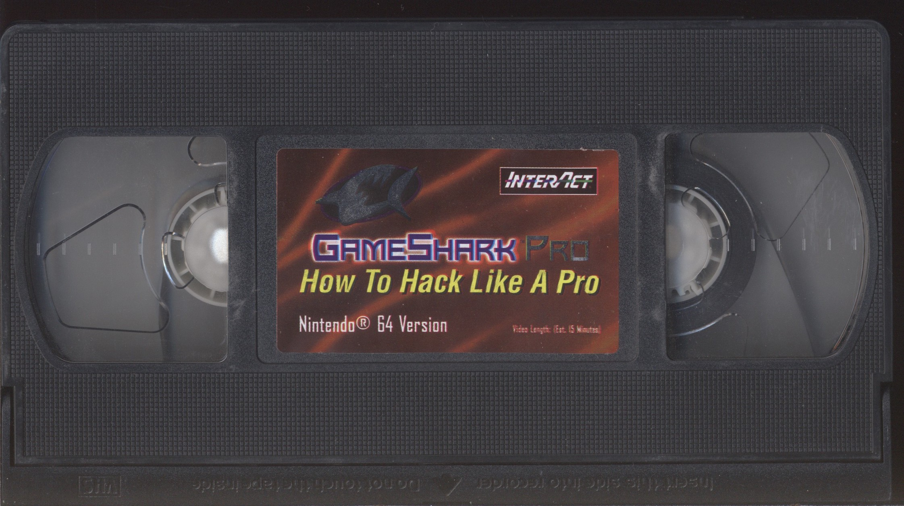

# SharkDumps

Collection of all known firmware/ROM/software dumps for retro video game enhancers (GameShark, Action Replay, Code Breaker, etc.).

## Legend

"Pristine" dumps are bit-for-bit identical to the original OEM factory firmware images, without any user modifications.

"Dirty" dumps may contain different games, cheats, and/or user preferences than the devices originally shipped with, but the actual firmware code should still be 100% original.

- __#G__ = Number of **G**ames pre-loaded
- __#C__ = Number of **C**heats pre-loaded
- __Pris?__ = Pristine OEM game/cheat list and settings
    - ✅ = Confirmed **Pristine**. All cheats and settings are identical to their original factory defaults.
    - ❌ = Confirmed **Dirty**. The owner of the cartridge modified some of the games, cheats, or preferences on the cart, so they no longer match the factory defaults.
    - ⚠️ = Provenance **Unknown**. We have not yet confirmed whether the games, cheats, and preferences are original or user-modified, so the dump is assumed to be dirty until proven otherwise.
    - `?` = We have not yet acquired a cart to dump the firmware.

---

## N64

 

### N64 device firmware

N64 GameShark "ROMs" contain the firmware, cheat list, _and_ user preferences, so dumping or reflashing a GameShark will also dump/overwrite the user's cheat list and settings as well.

#### N64 GameShark (US)

| Filename                                   | Version       | Build timestamp    | #G      | #C       | Pris? |
|:------------------------------------------ |:------------- |:------------------ | -------:| --------:|:-----:|
|    `gs-1.01-xxxxxxxx.bin`[^v1.01]          | `v1.01`       | _Unknown_          |     ?   |      ?   | ?     |
|   [`gs-1.02-19970801.bin`]                 | `v1.02`       | `1997-08-01T12:50` |    20   |    117   | ❌     |
|    `gs-1.03-xxxxxxxx.bin`[^v1.03]          | `v1.03`       | _Unknown_          |     ?   |      ?   | ?     |
| ~~[`gs-1.04-19970819-bad-codes.bin`][]~~   | `v1.04`       | `1997-08-19T10:35` |   ~~1~~ |    ~~3~~ | ❌     |
|   [`gs-1.04-19970819-good-codes.bin`][]    | `v1.04`       | `1997-08-19T10:35` |    22   |    142   | ❌     |
|   [`gs-1.05-19970904.bin`][]               | `v1.05`       | `1997-09-04T16:25` |    23   |    133   | ❌     |
|   [`gs-1.06-19970919.bin`][]               | `v1.06`       | `1997-09-19T14:25` |    21   |     76   | ❌     |
|   [`gs-1.07-19971107.bin`][]               | `v1.07`       | `1997-11-07T10:24` |    27   |    169   | ❌     |
|   [`gs-1.08-19971124.bin`][]               | `v1.08 (Nov)` | `1997-11-24T11:58` |     7   |     69   | ❌     |
|   [`gs-1.08-19971208.bin`][]               | `v1.08 (Dec)` | `1997-12-08T11:10` |    20   |    109   | ❌     |
|   [`gs-1.09-19980105-pristine.bin`][]      | `v1.09`       | `1998-01-05T17:40` |    37   |    166   | ✅     |
|   [`gs-2.00-19980305-pristine.bin`][]      | `v2.00 (Mar)` | `1998-03-05T08:06` |    36   |    165   | ✅     |
|   [`gs-2.00-19980406-pristine.bin`][]      | `v2.00 (Apr)` | `1998-04-06T10:05` |    36   |    165   | ✅     |
|   [`gs-2.10-19980825-dump1.bin`][]         | `v2.10`       | `1998-08-25T13:57` |    61   |    338   | ⚠️     |
|   [`gs-2.10-19980825-dump2.bin`][]         | `v2.10`       | `1998-08-25T13:57` |    61   |    348   | ⚠️     |
|    `gs-2.20-xxxxxxxx.bin`[^v2.20]          | `v2.20`       | _Unknown_          |     ?   |      ?   | ?     |
|   [`gs-2.21-19981218-dump1.bin`][]         | `v2.21`       | `1998-12-18T12:47` |   106   |    618   | ⚠️     |
|   [`gs-2.21-19981218-dump2.bin`][]         | `v2.21`       | `1998-12-18T12:47` |   112   |    675   | ⚠️     |
|   [`gs-2.21-19981218-dump3.bin`][]         | `v2.21`       | `1998-12-18T12:47` |   106   |    621   | ⚠️     |
|   [`gs-2.21-19981218-dump4.bin`][]         | `v2.21`       | `1998-12-18T12:47` |   113   |    656   | ⚠️     |
|    `gs-2.40-xxxxxxxx.bin`[^v2.40]          | `v2.40`       | _Unknown_          |     ?   |      ?   | ?     |
|   [`gs-2.50-xxxx0504-corrupt-codes.bin`][] | `v2.50`       | `????-05-04T12:58` |     ?   |      ?   | ❌     |
|   [`gs-2.50-xxxx0504-v3-codes.bin`][]      | `v2.50`       | `????-05-04T12:58` |     ?   |      ?   | ❌     |
|   [`gspro-3.00-19990401-pristine.bin`][]   | `v3.00`       | `1999-04-01T15:05` |   120   |   1124   | ✅     |
|   [`gspro-3.10-19990609-pristine.bin`][]   | `v3.10`       | `1999-06-09T16:50` |   120   |   1124   | ✅     |
|   [`gspro-3.20-19990622-pristine.bin`][]   | `v3.20`       | `1999-06-22T18:45` |   125   |   1192   | ✅     |
|   [`gspro-3.21-20000104-pristine.bin`][]   | `v3.21`       | `2000-01-04T14:26` |   122   |   1143   | ✅     |
|   [`gspro-3.30-20000327-pristine.bin`][]   | `v3.30 (Mar)` | `2000-03-27T09:54` |   188   |   2093   | ✅     |
|   [`gspro-3.30-20000404-pristine.bin`][]   | `v3.30 (Apr)` | `2000-04-04T15:56` |   188   |   2093   | ✅     |

[^v1.01]: `v1.01` is _presumed_ to exist because `v1.02` and `v1.04`–`v1.09` have all been verified, but we have not yet found any conclusive evidence of a `v1.01` cart.
[^v1.03]: `v1.03` is _assumed_ to exist because it falls between `v1.02` and `v1.04`, but we have not yet found any conclusive evidence of a `v1.03` cart.
[^v2.20]: `v2.20` is [**confirmed** to exist](https://imgur.com/2Sa2NaR), but we have not yet acquired a cart to dump its firmware.
[^v2.40]: `v2.40` supposedly exists according to the official [N64 GameShark Version Compatibility table](https://web.archive.org/web/20010720115238/http://www.gameshark.com/static/about_faq_version_n64.html), but we have not yet found any conclusive evidence of a `v2.40` cart.

#### N64 Action Replay (EU)

| Filename                     | Version | Build timestamp    | #G   | #C   | Pris? |
|:---------------------------- |:------- |:------------------ | ----:| ----:|:-----:|
| [`ar-1.11-19980415.bin`][]   | `v1.11` | `1998-04-15T14:56` |   26 |  258 | ⚠️     |
| [`arpro-3.0-19990324.bin`][] | `v3.00` | `1999-03-24T15:50` |   49 |  506 | ⚠️     |
| [`arpro-3.3-20000418.bin`][] | `v3.30` | `2000-04-18T16:08` |  181 | 2043 | ⚠️     |

#### N64 trainers

| Filename                                | Version | Build timestamp    |
|:--------------------------------------- |:------- |:------------------ |
| [`perfect_trainer-1.0b-20030618.bin`][] | `v1.0b` | `2003-06-18T00:00` |

[`ar-1.11-19980415.bin`]:               /n64/firmware/ar-1.11-19980415.bin
[`arpro-3.0-19990324.bin`]:             /n64/firmware/arpro-3.0-19990324.bin
[`arpro-3.3-20000418.bin`]:             /n64/firmware/arpro-3.3-20000418.bin
[`gs-1.02-19970801.bin`]:               /n64/firmware/gs-1.02-19970801.bin
[`gs-1.04-19970819-bad-codes.bin`]:     /n64/firmware/gs-1.04-19970819-bad-codes.bin
[`gs-1.04-19970819-good-codes.bin`]:    /n64/firmware/gs-1.04-19970819-good-codes.bin
[`gs-1.05-19970904.bin`]:               /n64/firmware/gs-1.05-19970904.bin
[`gs-1.06-19970919.bin`]:               /n64/firmware/gs-1.06-19970919.bin
[`gs-1.07-19971107.bin`]:               /n64/firmware/gs-1.07-19971107.bin
[`gs-1.08-19971124.bin`]:               /n64/firmware/gs-1.08-19971124.bin
[`gs-1.08-19971208.bin`]:               /n64/firmware/gs-1.08-19971208.bin
[`gs-1.09-19980105-pristine.bin`]:      /n64/firmware/gs-1.09-19980105-pristine.bin
[`gs-2.00-19980305-pristine.bin`]:      /n64/firmware/gs-2.00-19980305-pristine.bin
[`gs-2.00-19980406-pristine.bin`]:      /n64/firmware/gs-2.00-19980406-pristine.bin
[`gs-2.10-19980825-dump1.bin`]:         /n64/firmware/gs-2.10-19980825-dump1.bin
[`gs-2.10-19980825-dump2.bin`]:         /n64/firmware/gs-2.10-19980825-dump2.bin
[`gs-2.21-19981218-dump1.bin`]:         /n64/firmware/gs-2.21-19981218-dump1.bin
[`gs-2.21-19981218-dump2.bin`]:         /n64/firmware/gs-2.21-19981218-dump2.bin
[`gs-2.21-19981218-dump3.bin`]:         /n64/firmware/gs-2.21-19981218-dump3.bin
[`gs-2.21-19981218-dump4.bin`]:         /n64/firmware/gs-2.21-19981218-dump4.bin
[`gs-2.50-xxxx0504-corrupt-codes.bin`]: /n64/firmware/gs-2.50-xxxx0504-corrupt-codes.bin
[`gs-2.50-xxxx0504-v3-codes.bin`]:      /n64/firmware/gs-2.50-xxxx0504-v3-codes.bin
[`gspro-3.00-19990401-pristine.bin`]:   /n64/firmware/gspro-3.00-19990401-pristine.bin
[`gspro-3.10-19990609-pristine.bin`]:   /n64/firmware/gspro-3.10-19990609-pristine.bin
[`gspro-3.20-19990622-pristine.bin`]:   /n64/firmware/gspro-3.20-19990622-pristine.bin
[`gspro-3.21-20000104-pristine.bin`]:   /n64/firmware/gspro-3.21-20000104-pristine.bin
[`gspro-3.30-20000327-pristine.bin`]:   /n64/firmware/gspro-3.30-20000327-pristine.bin
[`gspro-3.30-20000404-pristine.bin`]:   /n64/firmware/gspro-3.30-20000404-pristine.bin
[`perfect_trainer-1.0b-20030618.bin`]:  /n64/firmware/perfect_trainer-1.0b-20030618.bin

### N64 device manuals

The Markdown versions have been transcribed as faithfully to the original printed materials as possible. All typos, misspellings, and odd/inconsistent style choices are intentionally left as-is.

#### DexDrive

- [DexDrive manual (digital)](/n64/manuals/n64_dexdrive_manual_digital.md)        • [PDF (original)](/n64/manuals/n64_dexdrive_manual_digital.pdf)
- [DexDrive manual (printed)](/n64/manuals/n64_dexdrive_manual_printed.md)        • [PDF (OCR)](/n64/manuals/n64_dexdrive_manual_printed_ocr.pdf)

#### GB Hunter

- [GB Hunter manual](/n64/manuals/n64_gb_hunter_manual.md)                        • [PDF (OCR)](/n64/manuals/n64_gb_hunter_manual_ocr.pdf)

#### GameShark (US)

- [GameShark v1.09 manual](/n64/manuals/n64_gameshark_v1.09_manual.md)            • [PDF (OCR)](/n64/manuals/n64_gameshark_v1.09_manual_ocr.pdf)
- [GameShark v2.0 manual](/n64/manuals/n64_gameshark_v2.00_manual.md)             • [PDF (OCR)](/n64/manuals/n64_gameshark_v2.00_manual_ocr.pdf)
- [GameShark v2.1 manual](/n64/manuals/n64_gameshark_v2.10_manual.md)             • [PDF (OCR)](/n64/manuals/n64_gameshark_v2.10_manual_ocr.pdf)
- [GameShark v2.2 manual](/n64/manuals/n64_gameshark_v2.20_manual.md)             • [PDF (OCR)](/n64/manuals/n64_gameshark_v2.20_manual_ocr.pdf)
- [GameShark Pro v3.0 manual](/n64/manuals/n64_gameshark_pro_v3.00_manual.md)     • [PDF (OCR)](/n64/manuals/n64_gameshark_pro_v3.00_manual_ocr.pdf)
- [GameShark Pro v3.1 manual](/n64/manuals/n64_gameshark_pro_v3.10_manual.md)     • [PDF (OCR)](/n64/manuals/n64_gameshark_pro_v3.10_manual_ocr.pdf)
- [GameShark Pro v3.2 manual](/n64/manuals/n64_gameshark_pro_v3.20_manual.md)     • [PDF (OCR)](/n64/manuals/n64_gameshark_pro_v3.20_manual_ocr.pdf)
-  GameShark Pro v3.3 manual                                                      • [PDF (OCR)](/n64/manuals/n64_gameshark_pro_v3.30_manual_ocr.pdf) - TODO
- [GameShark Pro PC Utils manual](/n64/manuals/n64_gameshark_pro_utils_manual.md) • [PDF (original)](/n64/manuals/n64_gameshark_pro_utils_manual_digital.pdf)

#### Xplorer 64 (EU)

- [Xplorer 64 manual 1999-06-21](/n64/manuals/xplorer64_19990621_manual.md)       • [PDF (OCR)](/n64/manuals/xplorer64_19990621_manual_ocr.pdf)

### N64 "How To Hack Like A Pro" VHS tapes

Most versions of the GameShark Pro came with a VHS tape entitled "How To Hack Like A Pro". (To save costs, the final production run of the GameShark Pro v3.3 did _not_ come with a VHS tape.)

The video demonstrates typical usage of the GameShark Pro, as well as the Code Generator feature, which lets you find your own GameShark codes.

There are two known versions of the N64 VHS tape. The informational content is nearly identical, but they contain different advertisements for different InterAct products.

All VHS tapes were captured with the following hardware and software:

- [Sony SLV-N750 VCR](https://www.crutchfield.com/S-ra1VCH8THBI/p_158SLV750S/Sony-SLV-N750.html) with composite A/V output
- [Blackmagic Intensity Pro 4K capture card](https://www.blackmagicdesign.com/products/intensitypro4k) with composite A/V input
- [Blackmagic Media Express (aka Desktop Video)](https://www.blackmagicdesign.com/support/family/capture-and-playback) with NTSC input

#### N64 VHS tape — version 1

[Watch on YouTube](https://youtu.be/JDmp0huzQvU) • [Audio transcription](/n64/vhs/n64_gameshark_pro_how_to_hack_like_a_pro_vhs_tape1.md)

Runtime: 15 minutes, 2 seconds.

Contains ads for the DexDrive, SuperPad 64, and V3FX Racing Wheel, and has a "Legal Notice" section at the end.

| Size     | Video file         | Compression | Codec            | Resolution/scan    |
| --------:|:------------------ |:----------- |:---------------- |:------------------ |
|  0.92 GB | [Download][dl-1.1] | Lossy       | H.265 (CQ = 75)  | 480p (progressive) |
|  5.47 GB | [Download][dl-1.2] | Lossless    | H.265 (CQ = 100) | 480p (progressive) |
| 19.19 GB | [Download][dl-1.3] | None (raw)  | Raw YUV          | 480i (interlaced)  |

[dl-1.1]: https://storage.googleapis.com/libreshark-dumps-bucket/n64/vhs/n64_gameshark_pro_how_to_hack_like_a_pro_vhs_tape1_480p_h265_cq75.mkv
[dl-1.2]: https://storage.googleapis.com/libreshark-dumps-bucket/n64/vhs/n64_gameshark_pro_how_to_hack_like_a_pro_vhs_tape1_480p_h265_cq100.mkv
[dl-1.3]: https://storage.googleapis.com/libreshark-dumps-bucket/n64/vhs/n64_gameshark_pro_how_to_hack_like_a_pro_vhs_tape1_480i_raw.mov

#### N64 VHS tape — version 2

[Watch on YouTube](https://youtu.be/mOGWxb8kuig) • [Audio transcription](/n64/vhs/n64_gameshark_pro_how_to_hack_like_a_pro_vhs_tape2.md)

Runtime: 14 minutes, 27 seconds.

Contains an ad for TurboRAM, and has a short section about the "Shark Link" (DB-25 parallel printer cable).

| Size     | Video file         | Compression | Codec            | Resolution/scan    |
| --------:|:------------------ |:----------- |:---------------- |:------------------ |
|  0.76 GB | [Download][dl-2.1] | Lossy       | H.265 (CQ = 75)  | 480p (progressive) |
|  4.95 GB | [Download][dl-2.2] | Lossless    | H.265 (CQ = 100) | 480p (progressive) |
| 18.44 GB | [Download][dl-2.3] | None (raw)  | Raw YUV          | 480i (interlaced)  |

[dl-2.1]: https://storage.googleapis.com/libreshark-dumps-bucket/n64/vhs/n64_gameshark_pro_how_to_hack_like_a_pro_vhs_tape2_480p_h265_cq75.mkv
[dl-2.2]: https://storage.googleapis.com/libreshark-dumps-bucket/n64/vhs/n64_gameshark_pro_how_to_hack_like_a_pro_vhs_tape2_480p_h265_cq100.mkv
[dl-2.3]: https://storage.googleapis.com/libreshark-dumps-bucket/n64/vhs/n64_gameshark_pro_how_to_hack_like_a_pro_vhs_tape2_480i_raw.mov

---

## Game Boy

### GB device manuals

- GameShark for Game Boy Pocket & Color            • [PDF (original)](/gb/manuals/gb_gameshark.pdf)
- Mega Memory Card for Game Boy and Game Boy Color • [PDF (original)](/gb/manuals/gb_mega_memory.pdf)

---

## GameCube

### GC device manuals

- Action Replay Max  • [PDF (original)](/gc/manuals/gc_action_replay_max.pdf)
- Action Replay v1.2 • [PDF (original)](/gc/manuals/gc_action_replay_v1.2.pdf)

---

## PlayStation

### PSX device manuals

- Cheats 'N Codes    • [PDF (original)](/psx/manuals/psx_cheats_n_codes.pdf)
- GameShark Pro v3.2 • [PDF (original)](/psx/manuals/psx_gamesharkpro_v3.2.pdf)
- GameShark CDX v3.4 • [PDF (original)](/psx/manuals/psx_gscdx_v3.4.pdf)
- GameShark Lite     • [PDF (original)](/psx/manuals/psx_gslite.pdf)
- SharkLink          • [PDF (original)](/psx/manuals/psx_sharklink.pdf)

---

## Dreamcast

### DC device manuals

- Cheats 'N Codes    • [PDF (original)](/dc/manuals/dc_cheats_n_codes.pdf)
- GameShark CDX v3.3 • [PDF (original)](/dc/manuals/dc_gameshark_cdx_v3.3_oem.pdf) • [PDF (OCR)](/dc/manuals/dc_gameshark_cdx_v3.3_ocr.pdf)
