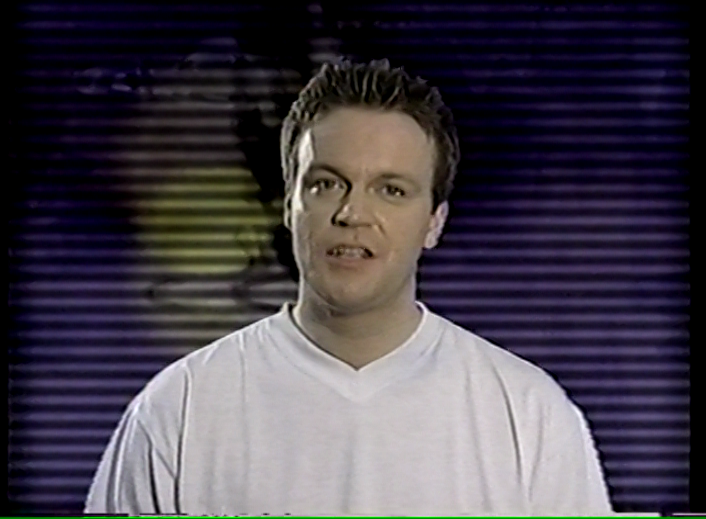
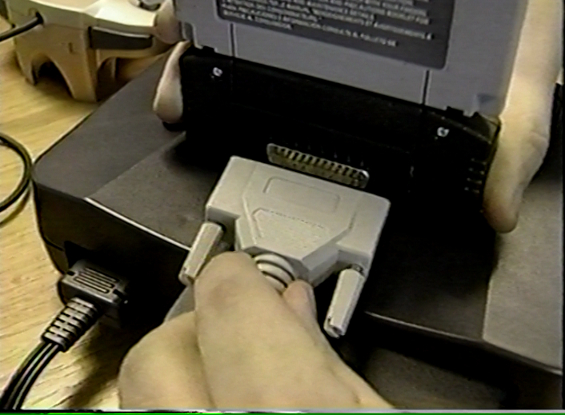

# SharkDumps

Collection of all known EEPROM firmware dumps and software utilities for retro video game enhancers (GameShark, Action Replay, Code Breaker, etc.).

## Legend

- __#G__ = Number of **G**ames pre-loaded
- __#C__ = Number of **C**heats pre-loaded
- __Clean?__
    - ⭐️ = Confirmed **Pristine**.  
        Firmware was dumped from a brand new, unused cartridge, and is byte-for-byte identical to the original factory image.
    - ✅ = Confirmed **Clean**.  
        All cheats and settings match the OEM defaults, but we don't know for sure if the dump is byte-for-byte identical to the original factory image.
    - ❌ = Confirmed **Dirty**.  
        The owner of the cartridge modified some of the games, cheats, or preferences on the cart, so they do not match the factory defaults, but the actual firmware code should still be 100% original.
    - ⚠️ = Provenance **Unknown**.  
        We have not yet confirmed whether the games, cheats, and preferences are original or user-modified, so the dump is assumed to be dirty until proven otherwise.
    - `?` = We have not yet acquired a cart to dump the firmware.

## N64 GameShark (NA)

### N64 GameShark screenshots

_Captured by @CheatoBaggins_

### N64 GameShark PCBs

_Expertly traced in CAD by @RWeick_

 

- [GameShark REF1329 PCB clone](https://github.com/RWeick/REF1329-N64-Gameshark-Clone) (Datel's original design)
- [GameShark REF1329 PCB fork](https://github.com/RWeick/N64-Gameshark-Pro-REF1329) (@RWeick's optimized design)

### N64 GameShark firmware

_Dumped by @Parasyte, @RWeick, and @CheatoBaggins_

N64 GameShark "ROMs" contain the not only the firmware, but also the user's cheat list and settings, so dumping or reflashing a GameShark will also dump or overwrite the user's codes and preferences.

| Filename                                     | Version       | Build timestamp    | #G      | #C       | Clean? |
|:-------------------------------------------- |:------------- |:------------------ | -------:| --------:|:------:|
|    `gs-1.01-xxxxxxxx.bin`[^v1.0x]            | `v1.01`       | _Unknown_          |     ?   |      ?   | ?      |
|   [`gs-1.02-19970801-dirty.bin`]             | `v1.02`       | `1997-08-01T12:50` |    20   |    117   | ❌      |
|    `gs-1.03-xxxxxxxx.bin`[^v1.0x]            | `v1.03`       | _Unknown_          |     ?   |      ?   | ?      |
| ~~[`gs-1.04-19970819-corrupt-codes.bin`][]~~ | `v1.04`       | `1997-08-19T10:35` |   ~~2~~ |    ~~3~~ | ❌      |
|   [`gs-1.04-19970819-valid-codes.bin`][]     | `v1.04`       | `1997-08-19T10:35` |    22   |    142   | ❌      |
|   [`gs-1.05-19970904-dirty.bin`][]           | `v1.05 (Thu)` | `1997-09-04T16:25` |    23   |    133   | ❌      |
|   [`gs-1.05-19970905-dirty.bin`][]           | `v1.05 (Fri)` | `1997-09-05T13:51` |    24   |    146   | ❌      |
|   [`gs-1.06-19970919-dirty.bin`][]           | `v1.06`       | `1997-09-19T14:25` |    21   |     76   | ❌      |
|   [`gs-1.07-19971107-dirty.bin`][]           | `v1.07`       | `1997-11-07T10:24` |    27   |    169   | ❌      |
|   [`gs-1.08-19971124-dirty.bin`][]           | `v1.08 (Nov)` | `1997-11-24T11:58` |     7   |     69   | ❌      |
|   [`gs-1.08-19971208-dirty.bin`][]           | `v1.08 (Dec)` | `1997-12-08T11:10` |    20   |    109   | ❌      |
|   [`gs-1.09-19980105-clean.bin`][]           | `v1.09`       | `1998-01-05T17:40` |    36   |    165   | ✅      |
|   [`gs-2.00-19980305-clean.bin`][]           | `v2.00 (Mar)` | `1998-03-05T08:06` |    36   |    165   | ✅      |
|   [`gs-2.00-19980406-clean.bin`][]           | `v2.00 (Apr)` | `1998-04-06T10:05` |    36   |    165   | ✅      |
|   [`gs-2.10-19980825-clean.bin`][]           | `v2.10`       | `1998-08-25T13:57` |    61   |    338   | ✅      |
|    `gs-2.20-xxxxxxxx.bin`[^v2.20]            | `v2.20`       | _Unknown_          |     ?   |      ?   | ?      |
|   [`gs-2.21-19981218-clean.bin`][]           | `v2.21`       | `1998-12-18T12:47` |   106   |    618   | ✅      |
|    `gs-2.40-xxxxxxxx.bin`[^v2.40]            | `v2.40`       | _Unknown_          |     ?   |      ?   | ?      |
|   [`gs-2.50-xxxx0504-v3.3-codes.bin`][]      | `v2.50`       | `????-05-04T12:58` |   188   |   2093   | ⚠️      |
|   [`gspro-3.00-19990401-clean.bin`][]        | `v3.00`       | `1999-04-01T15:05` |   120   |   1124   | ✅      |
|   [`gspro-3.10-19990609-clean.bin`][]        | `v3.10`       | `1999-06-09T16:50` |   120   |   1124   | ✅      |
|   [`gspro-3.20-19990622-clean.bin`][]        | `v3.20`       | `1999-06-22T18:45` |   122   |   1143   | ✅      |
|   [`gspro-3.21-20000104-pristine.bin`][]     | `v3.21`       | `2000-01-04T14:26` |   122   |   1143   | ⭐️      |
|   [`gspro-3.30-20000327-pristine.bin`][]     | `v3.30 (Mar)` | `2000-03-27T09:54` |   188   |   2093   | ⭐️      |
|   [`gspro-3.30-20000404-pristine.bin`][]     | `v3.30 (Apr)` | `2000-04-04T15:56` |   188   |   2093   | ⭐️      |
|   [`perfect_trainer-1.0b-20030618.bin`][]    | `v1.0b`       | `2003-06-18T00:00` |  _N/A_  |   _N/A_  | _N/A_  |

[^v1.0x]: `v1.01` and `v1.03` supposedly exist according to a [Krikzz forum post](https://krikzz.com/forum/index.php?topic=6585.0), [Reddit post](https://www.reddit.com/r/Roms/comments/dui43a/n64_gameshark_v32/), and [vspolaris article](https://vspolaris.tistory.com/24), but we have not yet found any conclusive evidence of a `v1.01` or `v1.03` cart.
[^v2.20]: `v2.20` is [**confirmed** to exist](https://imgur.com/2Sa2NaR), but we have not yet acquired a cart to dump its firmware.
[^v2.40]: `v2.40` supposedly exists according to the official [N64 GameShark Version Compatibility table](https://web.archive.org/web/20010720115238/http://www.gameshark.com/static/about_faq_version_n64.html), but we have not yet found any conclusive evidence of a `v2.40` cart.

[`gs-1.02-19970801-dirty.bin`]:         /n64/firmware/gs-1.02-19970801-dirty.bin
[`gs-1.04-19970819-corrupt-codes.bin`]: /n64/firmware/gs-1.04-19970819-corrupt-codes.bin
[`gs-1.04-19970819-valid-codes.bin`]:   /n64/firmware/gs-1.04-19970819-valid-codes.bin
[`gs-1.05-19970904-dirty.bin`]:         /n64/firmware/gs-1.05-19970904-dirty.bin
[`gs-1.05-19970905-dirty.bin`]:         /n64/firmware/gs-1.05-19970905-dirty.bin
[`gs-1.06-19970919-dirty.bin`]:         /n64/firmware/gs-1.06-19970919-dirty.bin
[`gs-1.07-19971107-dirty.bin`]:         /n64/firmware/gs-1.07-19971107-dirty.bin
[`gs-1.08-19971124-dirty.bin`]:         /n64/firmware/gs-1.08-19971124-dirty.bin
[`gs-1.08-19971208-dirty.bin`]:         /n64/firmware/gs-1.08-19971208-dirty.bin
[`gs-1.09-19980105-clean.bin`]:         /n64/firmware/gs-1.09-19980105-clean.bin
[`gs-2.00-19980305-clean.bin`]:         /n64/firmware/gs-2.00-19980305-clean.bin
[`gs-2.00-19980406-clean.bin`]:         /n64/firmware/gs-2.00-19980406-clean.bin
[`gs-2.10-19980825-clean.bin`]:         /n64/firmware/gs-2.10-19980825-clean.bin
[`gs-2.21-19981218-clean.bin`]:         /n64/firmware/gs-2.21-19981218-clean.bin
[`gs-2.50-xxxx0504-v3.3-codes.bin`]:    /n64/firmware/gs-2.50-xxxx0504-v3.3-codes.bin
[`gspro-3.00-19990401-clean.bin`]:      /n64/firmware/gspro-3.00-19990401-clean.bin
[`gspro-3.10-19990609-clean.bin`]:      /n64/firmware/gspro-3.10-19990609-clean.bin
[`gspro-3.20-19990622-clean.bin`]:      /n64/firmware/gspro-3.20-19990622-clean.bin
[`gspro-3.21-20000104-pristine.bin`]:   /n64/firmware/gspro-3.21-20000104-pristine.bin
[`gspro-3.30-20000327-pristine.bin`]:   /n64/firmware/gspro-3.30-20000327-pristine.bin
[`gspro-3.30-20000404-pristine.bin`]:   /n64/firmware/gspro-3.30-20000404-pristine.bin
[`perfect_trainer-1.0b-20030618.bin`]:  /n64/firmware/perfect_trainer-1.0b-20030618.bin

### N64 GameShark manuals

_Scanned, OCR'd, and transcribed by @CheatoBaggins_

The Markdown versions have been transcribed as faithfully to the original printed materials as possible. All typos, misspellings, and odd/inconsistent style choices are intentionally left as-is.

- [GameShark v1.09 manual](/n64/manuals/n64_gameshark_v1.09_manual.md)            • [PDF (OCR)](/n64/manuals/n64_gameshark_v1.09_manual_ocr.pdf)
- [GameShark v2.0 manual](/n64/manuals/n64_gameshark_v2.00_manual.md)             • [PDF (OCR)](/n64/manuals/n64_gameshark_v2.00_manual_ocr.pdf)
- [GameShark v2.1 manual](/n64/manuals/n64_gameshark_v2.10_manual.md)             • [PDF (OCR)](/n64/manuals/n64_gameshark_v2.10_manual_ocr.pdf)
- [GameShark v2.2 manual](/n64/manuals/n64_gameshark_v2.20_manual.md)             • [PDF (OCR)](/n64/manuals/n64_gameshark_v2.20_manual_ocr.pdf)
- [GameShark Pro v3.0 manual](/n64/manuals/n64_gameshark_pro_v3.00_manual.md)     • [PDF (OCR)](/n64/manuals/n64_gameshark_pro_v3.00_manual_ocr.pdf)
- [GameShark Pro v3.1 manual](/n64/manuals/n64_gameshark_pro_v3.10_manual.md)     • [PDF (OCR)](/n64/manuals/n64_gameshark_pro_v3.10_manual_ocr.pdf)
- [GameShark Pro v3.2 manual](/n64/manuals/n64_gameshark_pro_v3.20_manual.md)     • [PDF (OCR)](/n64/manuals/n64_gameshark_pro_v3.20_manual_ocr.pdf)
-  GameShark Pro v3.3 manual                                                      • [PDF (OCR)](/n64/manuals/n64_gameshark_pro_v3.30_manual_ocr.pdf) - TODO
- [GameShark Pro PC Utils manual](/n64/manuals/n64_gameshark_pro_utils_manual.md) • [PDF (original)](/n64/manuals/n64_gameshark_pro_utils_manual_digital.pdf)

### N64 _How To Hack Like A Pro_ VHS tapes

_Captured and encoded by @CheatoBaggins_

Most versions of the GameShark Pro came with a VHS tape entitled "How To Hack Like A Pro". (To save costs, the final production run of the GameShark Pro v3.3 did _not_ come with a VHS tape.)

The video demonstrates typical usage of the GameShark Pro, as well as the Code Generator feature, which lets you find your own GameShark codes.

There are two known versions of the N64 VHS tape. The informational content is nearly identical, but they contain different advertisements for different InterAct products.

All VHS tapes were captured with the following hardware and software:

- [Sony SLV-N750 VCR](https://www.crutchfield.com/S-ra1VCH8THBI/p_158SLV750S/Sony-SLV-N750.html) with composite A/V output
- [Blackmagic Intensity Pro 4K capture card](https://www.blackmagicdesign.com/products/intensitypro4k) with composite A/V input
- [Blackmagic Media Express (aka Desktop Video)](https://www.blackmagicdesign.com/support/family/capture-and-playback) with NTSC input

#### N64 VHS screenshots

#### N64 VHS tape — version 1

[Watch on YouTube](https://youtu.be/JDmp0huzQvU) • [Audio transcription](/n64/vhs/n64_gspro_vhs_tape1.md)

Runtime: 15 minutes, 2 seconds.

Contains ads for the DexDrive, SuperPad 64, and V3FX Racing Wheel, and has a "Legal Notice" section at the end.

| Size     | Video file         | Compression | Codec            | Resolution/scan    |
| --------:|:------------------ |:----------- |:---------------- |:------------------ |
|  0.92 GB | [Download][dl-1.1] | Lossy       | H.265 (CQ = 75)  | 480p (progressive) |
|  5.47 GB | [Download][dl-1.2] | Lossless    | H.265 (CQ = 100) | 480p (progressive) |
| 19.19 GB | [Download][dl-1.3] | None (raw)  | Raw YUV          | 480i (interlaced)  |

[dl-1.1]: https://storage.googleapis.com/libreshark-dumps-bucket/n64/vhs/n64_gspro_vhs_tape1_480p_h265_cq75.mkv
[dl-1.2]: https://storage.googleapis.com/libreshark-dumps-bucket/n64/vhs/n64_gspro_vhs_tape1_480p_h265_cq100.mkv
[dl-1.3]: https://storage.googleapis.com/libreshark-dumps-bucket/n64/vhs/n64_gspro_vhs_tape1_480i_raw.mov

#### N64 VHS tape — version 2

[Watch on YouTube](https://youtu.be/mOGWxb8kuig) • [Audio transcription](/n64/vhs/n64_gspro_vhs_tape2.md)

Runtime: 14 minutes, 27 seconds.

Contains an ad for TurboRAM, and has a short section about the "Shark Link" (DB-25 parallel printer cable).

| Size     | Video file         | Compression | Codec            | Resolution/scan    |
| --------:|:------------------ |:----------- |:---------------- |:------------------ |
|  0.76 GB | [Download][dl-2.1] | Lossy       | H.265 (CQ = 75)  | 480p (progressive) |
|  4.95 GB | [Download][dl-2.2] | Lossless    | H.265 (CQ = 100) | 480p (progressive) |
| 18.44 GB | [Download][dl-2.3] | None (raw)  | Raw YUV          | 480i (interlaced)  |

[dl-2.1]: https://storage.googleapis.com/libreshark-dumps-bucket/n64/vhs/n64_gspro_vhs_tape2_480p_h265_cq75.mkv
[dl-2.2]: https://storage.googleapis.com/libreshark-dumps-bucket/n64/vhs/n64_gspro_vhs_tape2_480p_h265_cq100.mkv
[dl-2.3]: https://storage.googleapis.com/libreshark-dumps-bucket/n64/vhs/n64_gspro_vhs_tape2_480i_raw.mov

## N64 Action Replay (EU)

| Filename                     | Version | Build timestamp    | #G   | #C   | Clean? |
|:---------------------------- |:------- |:------------------ | ----:| ----:|:------:|
| [`ar-1.11-19980415.bin`][]   | `v1.11` | `1998-04-15T14:56` |   26 |  258 | ⚠️      |
| [`arpro-3.0-19990324.bin`][] | `v3.00` | `1999-03-24T15:50` |   49 |  506 | ⚠️      |
| [`arpro-3.3-20000418.bin`][] | `v3.30` | `2000-04-18T16:08` |  181 | 2043 | ⚠️      |

[`ar-1.11-19980415.bin`]:   /n64/firmware/ar-1.11-19980415.bin
[`arpro-3.0-19990324.bin`]: /n64/firmware/arpro-3.0-19990324.bin
[`arpro-3.3-20000418.bin`]: /n64/firmware/arpro-3.3-20000418.bin

## N64 Xplorer 64 (EU)

### Xplorer 64 screenshots

_Captured by @CheatoBaggins_

### Xplorer 64 PCBs

_Expertly traced in CAD by @RWeick_

- [Xplorer 64 PCB clone](https://github.com/RWeick/FCD-0003.1S-Xplorer64)

### Xplorer 64 firmware

_Dumped by @RWeick and @danhans42_

| Filename                                             | Version   | Build  | Build timestamp       | Language | #G | #C | Clean? | Unencrypted? |
|:---------------------------------------------------- |:--------- | ------:|:--------------------- |:-------- | --:| --:|:------:|:------------:|
| [`xp64-green-v1.000e-b1834-19990816.enc`][][^b1834]  | `v1.000e` | `1834` | `1999-08-16T12:10:59` | English  |  ? |  ? | ⚠️      | ❌            |
| [`xp64-orange-v1.067e-b2515-20000505.enc`][][^b2515] | `v1.067e` | `2515` | `2000-05-05T23:42:59` | English  |  ? |  ? | ⚠️      | ❌            |
| [`xp64-update-v1.067e-b2510-2000xxxx.bin`][][^b2510] | `v1.067e` | `2510` | `2000-xx-xxTxx:xx:xx` | English  |  ? |  ? | ⚠️      | ✅            |

[`xp64-green-v1.000e-b1834-19990816.enc`]: /n64/firmware/xp64-green-v1.000e-b1834-19990816.enc
[`xp64-orange-v1.067e-b2515-20000505.enc`]: /n64/firmware/xp64-orange-v1.067e-b2515-20000505.enc
[`xp64-update-v1.067e-b2510-2000xxxx.bin`]: /n64/firmware/xp64-update-v1.067e-b2510-2000xxxx.bin

[^b1834]: Raw **encrypted** firmware dump from a green Xplorer 64 cart.
[^b2515]: Raw **encrypted** firmware dump from an orange Xplorer 64 cart.
[^b2510]: Plain **unencrypted** firmware update file from Blaze.

### Xplorer 64 manuals

_Scanned, OCR'd, and transcribed by @CheatoBaggins_

- [Xplorer 64 offline manual 1999-06-21](/n64/manuals/xplorer64_19990621_manual.md) • [PDF (OCR)](/n64/manuals/xplorer64_19990621_manual_ocr.pdf)
- [Xplorer 64 online manual](https://web.archive.org/web/20100828090705/http://www.kai666.com/x-plorer_64_manual_index.htm)
    - [Boot modes](https://web.archive.org/web/20170702014101/http://www.kai666.com/important.htm)

## N64 GB Hunter (NA)

### GB Hunter screenshots

_Captured by @CheatoBaggins_

### GB Hunter firmware

_Dumped by @RWeick_

| Filename                          | Version   | Build timestamp            | #G | #C | Clean? |
|:--------------------------------- |:--------- |:-------------------------- | --:| --:|:------:|
| [`gb-hunter-1998-pristine.bin`][] | _Unknown_ | _Unknown_                  |  ? |  ? | ⭐️      |

[`gb-hunter-1998-pristine.bin`]: /n64/firmware/gb-hunter-1998-pristine.bin

### GB Hunter manual

_Scanned, OCR'd, and transcribed by @CheatoBaggins_

- [GB Hunter manual](/n64/manuals/n64_gb_hunter_manual.md) • [PDF (OCR)](/n64/manuals/n64_gb_hunter_manual_ocr.pdf)

## N64 Game Booster (EU)

See https://tcrf.net/GB_Hunter

## N64 DexDrive

_Scanned, OCR'd, and transcribed by @CheatoBaggins_

- [DexDrive manual (digital)](/n64/manuals/n64_dexdrive_manual_digital.md) • [PDF (original)](/n64/manuals/n64_dexdrive_manual_digital.pdf)
- [DexDrive manual (printed)](/n64/manuals/n64_dexdrive_manual_printed.md) • [PDF (OCR)](/n64/manuals/n64_dexdrive_manual_printed_ocr.pdf)

---

## Game Boy

### GB device manuals

- GameShark for Game Boy Pocket & Color            • [PDF (original)](/gb/manuals/gb_gameshark.pdf)
- Mega Memory Card for Game Boy and Game Boy Color • [PDF (original)](/gb/manuals/gb_mega_memory.pdf)

---

## GameCube

### GC device manuals

- Action Replay Max  • [PDF (original)](/gc/manuals/gc_action_replay_max.pdf)
- Action Replay v1.2 • [PDF (original)](/gc/manuals/gc_action_replay_v1.2.pdf)

---

## PlayStation

### PSX device manuals

- Cheats 'N Codes    • [PDF (original)](/psx/manuals/psx_cheats_n_codes.pdf)
- GameShark Pro v3.2 • [PDF (original)](/psx/manuals/psx_gamesharkpro_v3.2.pdf)
- GameShark CDX v3.4 • [PDF (original)](/psx/manuals/psx_gscdx_v3.4.pdf)
- GameShark Lite     • [PDF (original)](/psx/manuals/psx_gslite.pdf)
- SharkLink          • [PDF (original)](/psx/manuals/psx_sharklink.pdf)

---

## Dreamcast

### DC device manuals

- Cheats 'N Codes    • [PDF (original)](/dc/manuals/dc_cheats_n_codes.pdf)
- GameShark CDX v3.3 • [PDF (original)](/dc/manuals/dc_gameshark_cdx_v3.3_oem.pdf) • [PDF (OCR)](/dc/manuals/dc_gameshark_cdx_v3.3_ocr.pdf)

## Credits

This project is the result of many years of hard work and brilliant insight from some _amazing_ hackers.
It would not be possible without them!

Most notably, we wish to thank:

- @Parasyte - Legendary GameShark hacker and OG N64 reverse engineer
- @RWeick - Crazy-talented Kaminoan cloner of PCBs

_If you feel that someone is missing from this list, please submit a PR to add them!_ 😀
