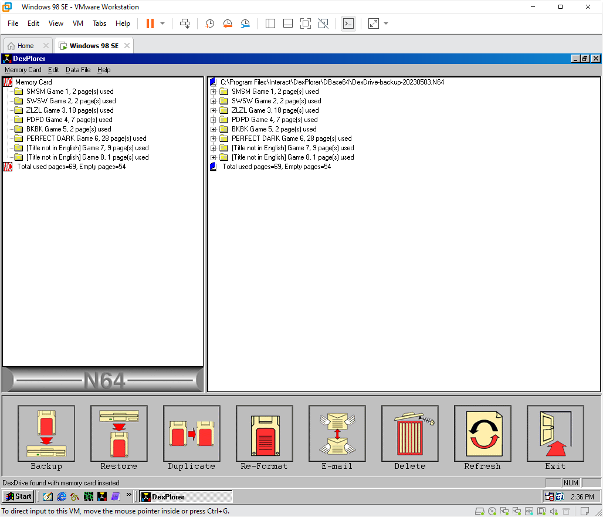
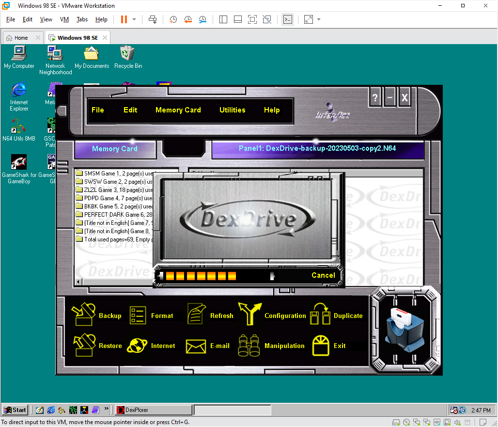

# N64 DexDrive

The DexDrive is an N64 memory card reader/writer/backup device that connects to a Windows 98-XP PC with an RS-232 serial cable.

## PC software

### DexPlorer v1.10.950 screenshots

### DexPlorer v2.00.902 screenshots

### Utilities

| Program                       | Build date   | Author                                   |
|:----------------------------- |:------------ |:---------------------------------------- |
| **[DexPlorer v1.10.950][]**   | `1999-01-05` | Datel/InterAct                           |
|   [DexPlorer v2.00.902][]     | `2000-01-24` | Datel/InterAct                           |
|   [Dex2Save][]                | `1998-02-20` | "Ximeter" <ximeter@usa.net>              |
|   [MemPack Save Converter][]  | `1999-03-28` | "Sound of Silence" <silence@poboxes.com> |
|   [MemPack to N64 Uploader][] | `1999-10-13` | "Destop of Crazy Nation"                 |
|   [64Scener Tools][]          | -            | [64Scener mirror][]                      |

[DexPlorer v1.10.950]:     /n64/tools/dexdrive/n64-dexdrive-sv-388_200.902_at-2000-01-24.zip
[DexPlorer v2.00.902]:     /n64/tools/dexdrive/n64-dexdrive-sv-388_110.950_at-1999-01-05.zip
[Dex2Save]:                /n64/tools/dexdrive/dex2save
[MemPack Save Converter]:  /n64/tools/dexdrive/mempack_save_converter
[MemPack to N64 Uploader]: /n64/tools/dexdrive/mempack_to_n64_uploader
[64Scener Tools]:          /n64/tools/dexdrive/misc
[64Scener mirror]:         http://n64.icequake.net/mirror/64scener.parodius.com

## Manuals

_Scanned, OCR'd, and transcribed by @CheatoBaggins_

- [DexDrive manual (digital)](/n64/manuals/n64_dexdrive_manual_digital.md) • [PDF (original)](/n64/manuals/n64_dexdrive_manual_digital.pdf)
- [DexDrive manual (printed)](/n64/manuals/n64_dexdrive_manual_printed.md) • [PDF (OCR)](/n64/manuals/n64_dexdrive_manual_printed_ocr.pdf)

## Box art

_Photographed by @CheatoBaggins_

