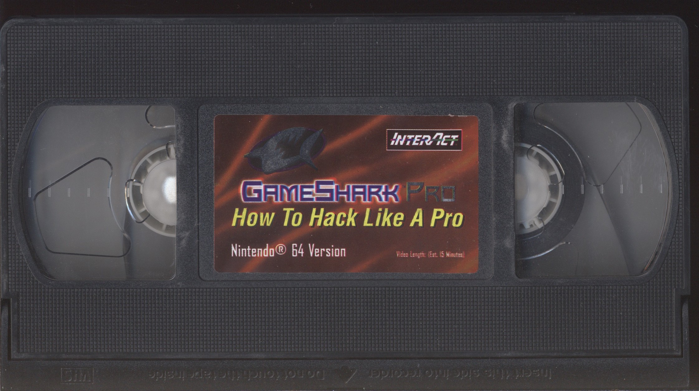
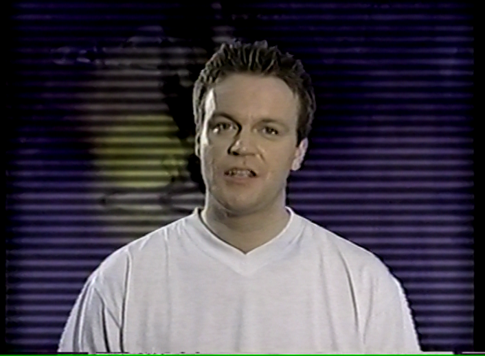
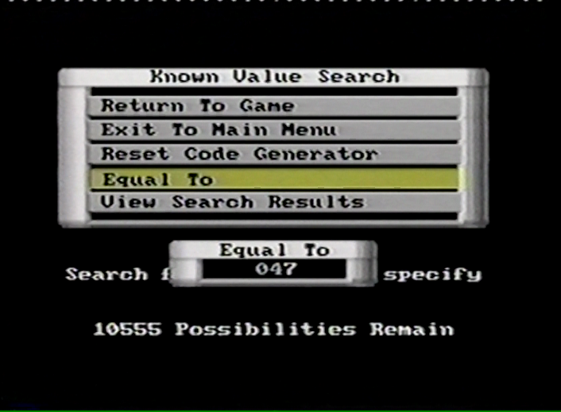
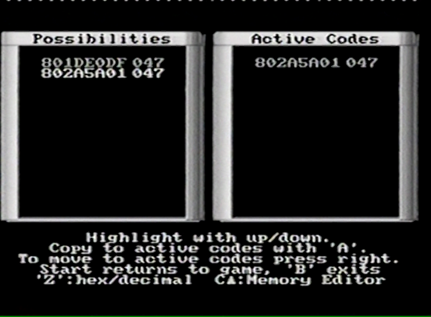
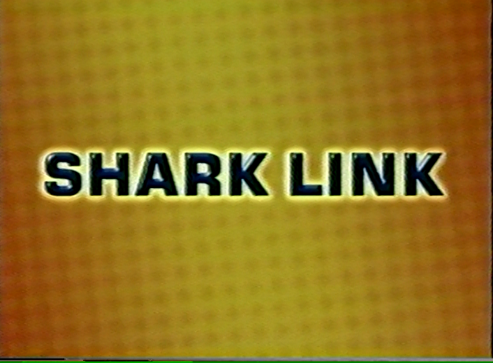
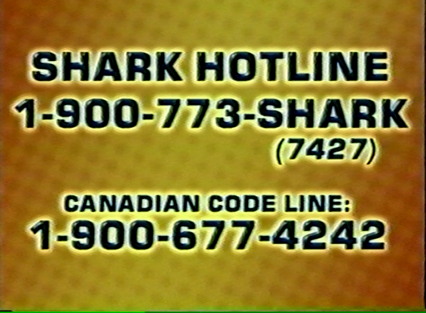

# N64 GameShark / GameShark Pro

_NOTE: **GameShark**, [Action Replay](/n64-actionreplay.md), [Equalizer](/n64-equalizer.md), and [Game Buster](/n64-gamebuster.md) are all just country-specific brand names for the exact same hardware._

**GameShark** was designed/manufactured in England by Datel, and marketed/distributed in North America by InterAct Accessories.

## Shells

_Photographed by @CheatoBaggins_

## PCBs

_Expertly traced, optimized, and reverse engineered by @RWeick_

### Datel REF1329 PCB

Most versions of the N64 GameShark use the same proprietary ASIC chip: the LZ9FC17 Datel GAL.

Because these chips are no longer manufactured, and the internal design was never made public, the only way to make _more_ of them (short of [decapping the chip](https://www.youtube.com/watch?v=HwEdqAb2l50), which is beyond our skill set) is to observe their inputs and outputs and intuit the logic needed to produce the same result. @RWeick has done this, and graciously provided schematics for two different boards to solve two different problems:

1. **[Fully open source clone with modern hardware](https://github.com/RWeick/REF1329-N64-Gameshark-Clone)**
    - **This is almost certainly the one you want!**
    - Designed with easily-sourced components
    - No donor parts required
    - 100% compatible with Datel's firmware images
    - The [Sanni Cart Reader](https://github.com/sanni/cartreader/wiki/Reflashing-a-Gameshark) is not yet compatible with the Altera EPM240 chip used in this design, but @RWeick is working on a software update for the Sanni that will add full read/write support
2. [Replacement board for original Datel LZ9FC17 GALs](https://github.com/RWeick/N64-Gameshark-Pro-REF1329)
    - This is a "rescue" board for good (working) LZ9FC17 chips
    - It will ***only*** work with an authentic Datel LZ9FC17 chip (which is no longer being manufactured and can only be found in old GameSharks)
    - If you accidentally fry the main board in a GameShark/AR, but the GAL still works, this PCB can be used as a fully compatible, optimized replacement for the fried OEM board (think of it like transplanting a shark's brain into a robot body)

## Screenshots

_Captured by @CheatoBaggins_

## Firmware

_Dumped by @Parasyte, @RWeick, @CheatoBaggins, and SharkByte_

N64 GameShark "ROMs" contain not just the firmware, but also the user's cheat list and settings, so dumping or reflashing a GameShark will also dump or overwrite the user's codes and preferences.

N64 GameSharks can be dumped (read) and reflashed (written) with a [Sanni Cart Reader](https://github.com/sanni/cartreader/wiki/Reflashing-a-Gameshark).

**NOTE:** As of 2023-05-02, the Sanni does _not_ yet support GameShark v1.08 and earlier hardware, which use different EEPROM chips. @RWeick is working on a patch that will fix this problem and allow _all_ GameShark hardware to be read/written.

***Legend:***

- __#G__ = Number of **G**ames pre-loaded
- __#C__ = Number of **C**heats pre-loaded
- __Clean?__
    - ⭐️ = Confirmed **Pristine**.  
        Firmware was dumped from a brand new, unused cartridge, and is byte-for-byte identical to the original factory image.
    - ✅ = Confirmed **Clean**.  
        All cheats and settings _should_ match the OEM defaults, but we don't know for sure if the dump is byte-for-byte identical to the original factory image.
    - ❌ = Confirmed **Dirty**.  
        The owner of the cartridge modified some of the games, cheats, or preferences on the cart, so they do not match the factory defaults, but the actual firmware code should still be 100% original.
    - ⚠️ = Provenance **Unknown**.  
        We have not yet confirmed whether the games, cheats, and preferences are original or user-modified, so the dump is assumed to be dirty until proven otherwise.
    - `?` = We have not yet acquired a cart to dump the firmware.

| Filename                                     | Version       | Build timestamp    | #G      | #C       | Clean? |
|:-------------------------------------------- |:------------- |:------------------ | -------:| --------:|:------:|
|    `gs-1.01-xxxxxxxx.bin`[^v1.0x]            | `v1.01`       | _Unknown_          |     ?   |      ?   | ?      |
|   [`gs-1.02-19970801-dirty.bin`]             | `v1.02`       | `1997-08-01T12:50` |    20   |    117   | ❌      |
|    `gs-1.03-xxxxxxxx.bin`[^v1.0x]            | `v1.03`       | _Unknown_          |     ?   |      ?   | ?      |
| ~~[`gs-1.04-19970819-corrupt-codes.bin`][]~~ | `v1.04`       | `1997-08-19T10:35` |   ~~2~~ |    ~~3~~ | ❌      |
|   [`gs-1.04-19970819-valid-codes.bin`][]     | `v1.04`       | `1997-08-19T10:35` |    22   |    142   | ❌      |
|   [`gs-1.05-19970904-dirty.bin`][]           | `v1.05 (Thu)` | `1997-09-04T16:25` |    23   |    133   | ❌      |
|   [`gs-1.05-19970905-dirty.bin`][]           | `v1.05 (Fri)` | `1997-09-05T13:51` |    24   |    146   | ❌      |
|   [`gs-1.06-19970919-dirty.bin`][]           | `v1.06`       | `1997-09-19T14:25` |    21   |     76   | ❌      |
|   [`gs-1.07-19971027-dirty.bin`][]           | `v1.07 (Oct)` | `1997-10-27T17:21` |    28   |    175   | ❌      |
|   [`gs-1.07-19971107-dirty.bin`][]           | `v1.07 (Nov)` | `1997-11-07T10:24` |    27   |    169   | ❌      |
|   [`gs-1.08-19971124-dirty.bin`][]           | `v1.08 (Nov)` | `1997-11-24T11:58` |     7   |     69   | ❌      |
|   [`gs-1.08-19971208-dirty.bin`][]           | `v1.08 (Dec)` | `1997-12-08T11:10` |    20   |    109   | ❌      |
|   [`gs-1.09-19980105-clean.bin`][]           | `v1.09`       | `1998-01-05T17:40` |    36   |    165   | ✅      |
|   [`gs-2.00-19980305-clean.bin`][]           | `v2.00 (Mar)` | `1998-03-05T08:06` |    36   |    165   | ✅      |
|   [`gs-2.00-19980406-clean.bin`][]           | `v2.00 (Apr)` | `1998-04-06T10:05` |    36   |    165   | ✅      |
|   [`gs-2.10-19980825-clean.bin`][]           | `v2.10`       | `1998-08-25T13:57` |    61   |    338   | ✅      |
|    `gs-2.20-xxxxxxxx.bin`[^v2.20]            | `v2.20`       | _Unknown_          |     ?   |      ?   | ?      |
|   [`gs-2.21-19981218-clean.bin`][]           | `v2.21`       | `1998-12-18T12:47` |   106   |    618   | ✅      |
|    `gs-2.40-xxxxxxxx.bin`[^v2.40]            | `v2.40`       | _Unknown_          |     ?   |      ?   | ?      |
|   [`gs-2.50-xxxx0504-v3.3-codes.bin`][]      | `v2.50`       | `????-05-04T12:58` |   188   |   2093   | ⚠️      |
|   [`gspro-3.00-19990401-clean.bin`][]        | `v3.00`       | `1999-04-01T15:05` |   120   |   1124   | ✅      |
|   [`gspro-3.10-19990609-clean.bin`][]        | `v3.10`       | `1999-06-09T16:50` |   120   |   1124   | ✅      |
|   [`gspro-3.20-19990622-clean.bin`][]        | `v3.20`       | `1999-06-22T18:45` |   122   |   1143   | ✅      |
|   [`gspro-3.21-20000104-pristine.bin`][]     | `v3.21`       | `2000-01-04T14:26` |   122   |   1143   | ⭐️      |
|   [`gspro-3.30-20000327-pristine.bin`][]     | `v3.30 (Mar)` | `2000-03-27T09:54` |   188   |   2093   | ⭐️      |
|   [`gspro-3.30-20000404-pristine.bin`][]     | `v3.30 (Apr)` | `2000-04-04T15:56` |   188   |   2093   | ⭐️      |
|   [`perfect_trainer-1.0b-20030618.bin`][]    | `v1.0b`       | `2003-06-18T00:00` |  _N/A_  |   _N/A_  | _N/A_  |

[^v1.0x]: `v1.01` and `v1.03` supposedly exist according to a [Krikzz forum post](https://krikzz.com/forum/index.php?topic=6585.0), [Reddit post](https://www.reddit.com/r/Roms/comments/dui43a/n64_gameshark_v32/), and [vspolaris article](https://vspolaris.tistory.com/24), but we have not yet found any conclusive evidence of a `v1.01` or `v1.03` cart.
[^v2.20]: `v2.20` is [**confirmed** to exist](https://imgur.com/2Sa2NaR), but we have not yet acquired a cart to dump its firmware.
[^v2.40]: `v2.40` supposedly exists according to the official [N64 GameShark Version Compatibility table](https://web.archive.org/web/20010720115238/http://www.gameshark.com/static/about_faq_version_n64.html), but we have not yet found any conclusive evidence of a `v2.40` cart.

[`gs-1.02-19970801-dirty.bin`]:         /n64/firmware/gs-1.02-19970801-dirty.bin
[`gs-1.04-19970819-corrupt-codes.bin`]: /n64/firmware/gs-1.04-19970819-corrupt-codes.bin
[`gs-1.04-19970819-valid-codes.bin`]:   /n64/firmware/gs-1.04-19970819-valid-codes.bin
[`gs-1.05-19970904-dirty.bin`]:         /n64/firmware/gs-1.05-19970904-dirty.bin
[`gs-1.05-19970905-dirty.bin`]:         /n64/firmware/gs-1.05-19970905-dirty.bin
[`gs-1.06-19970919-dirty.bin`]:         /n64/firmware/gs-1.06-19970919-dirty.bin
[`gs-1.07-19971027-dirty.bin`]:         /n64/firmware/gs-1.07-19971027-dirty.bin
[`gs-1.07-19971107-dirty.bin`]:         /n64/firmware/gs-1.07-19971107-dirty.bin
[`gs-1.08-19971124-dirty.bin`]:         /n64/firmware/gs-1.08-19971124-dirty.bin
[`gs-1.08-19971208-dirty.bin`]:         /n64/firmware/gs-1.08-19971208-dirty.bin
[`gs-1.09-19980105-clean.bin`]:         /n64/firmware/gs-1.09-19980105-clean.bin
[`gs-2.00-19980305-clean.bin`]:         /n64/firmware/gs-2.00-19980305-clean.bin
[`gs-2.00-19980406-clean.bin`]:         /n64/firmware/gs-2.00-19980406-clean.bin
[`gs-2.10-19980825-clean.bin`]:         /n64/firmware/gs-2.10-19980825-clean.bin
[`gs-2.21-19981218-clean.bin`]:         /n64/firmware/gs-2.21-19981218-clean.bin
[`gs-2.50-xxxx0504-v3.3-codes.bin`]:    /n64/firmware/gs-2.50-xxxx0504-v3.3-codes.bin
[`gspro-3.00-19990401-clean.bin`]:      /n64/firmware/gspro-3.00-19990401-clean.bin
[`gspro-3.10-19990609-clean.bin`]:      /n64/firmware/gspro-3.10-19990609-clean.bin
[`gspro-3.20-19990622-clean.bin`]:      /n64/firmware/gspro-3.20-19990622-clean.bin
[`gspro-3.21-20000104-pristine.bin`]:   /n64/firmware/gspro-3.21-20000104-pristine.bin
[`gspro-3.30-20000327-pristine.bin`]:   /n64/firmware/gspro-3.30-20000327-pristine.bin
[`gspro-3.30-20000404-pristine.bin`]:   /n64/firmware/gspro-3.30-20000404-pristine.bin
[`perfect_trainer-1.0b-20030618.bin`]:  /n64/firmware/perfect_trainer-1.0b-20030618.bin

To view the contents of the ROM dumps, use our [N64 GameShark ROM hexpattern](/hexpats/patterns/imhex-n64-gsrom-pattern.hexpat) for the [ImHex editor](https://imhex.werwolv.net/).

## PC software

For instructions on how to run this software in a Windows 98 SE virtual machine, see the [GameShark Fandom wiki](https://gameshark.fandom.com/wiki/Nintendo_64#Connecting_the_parallel_port_of_an_N64_GameShark_Pro_to_a_modern_PC).

**Official Datel N64 Utils** `v1.01` (`1999-04-06`), patched by @Parasyte and "Deku Omega" (`2007-04-22`):

**Game Software Code Creator** `v1.10.102` (`2002-01-05`) by Code Master (aka CMX):

### Parallel port (link cable) tools

| Tool                                    | Build date   | OSes       | Prereqs                      | Authors             |
|:--------------------------------------- |:------------ |:---------- |:---------------------------- |:------------------- |
| [Official Datel N64 Utils (original)][] | `2000-03-27` | 98, ME, XP | [`UserPort`][][^upxp] for XP | Datel               |
| [Official Datel N64 Utils (patched)][]  | `2007-04-22` | 98, ME, XP | [`UserPort`][][^upxp] for XP | Datel, @Parasyte    |
| [GSCC v1.10.101 (98)][]                 | `2002-01-05` | 98/ME only | -                            | [CMX][]             |
| [GSCC v1.10.101 (XP)][]                 | `2006-04-14` | 98, ME, XP | [`UserPort`][][^upxp] for XP | [CMX][]             |
| [GSCC v1.10.102 (XP)][]                 | `2007-04-17` | 98, ME, XP | [`UserPort`][][^upxp] for XP | [CMX][]             |
| [UserPort parallel driver for XP][]     | `2001-05-29` | 2000, XP   | -                            | [Tomas Franzon][]   |
| [N64 Remote Debugger (with C source)][] | `2014-08-10` | Linux only | Python, [SCons][]            | [@Parasyte/n64rd][] |

[^upxp]: [`UserPort`][] is only required for ***physical*** Windows 2000 and XP machines (i.e., old hardware) with built-in parallel ports. Virtual Machines with PCIe parallel port cards do _not_ require `UserPort`, and will actually BSOD if you try to install it.

### ROM and cheat management tools

| Tool                                 | Build date   | OSes      | Prereqs        | Authors          |
|:------------------------------------ |:------------ |:--------- |:-------------- |:---------------- |
| [GS ROM decrypter/encrypter][]       | `2001-05-06` | _Any?_    | -              | [CMX][], Hanimar |
| [Skaman's GS ROM splitter][]         | `2015-04-11` | _Any?_    | -              | Skaman           |
| [GSCentral Cheat Manager][]          | `2007-02-01` | XP and up | [`.NET 3.5`][] | SK Genius        |

### Quality-of-life utilities for Windows 98

| Tool                              | Build date   | OSes      | Authors                |
|:--------------------------------- |:------------ |:--------- |:---------------------- |
| [HxD hex editor v1.7.7.0 setup][] | `2009-04-03` | 95 and up | [Maël Hörz][]          |
| [MetaPad v3.6 portable][]         | `2011-05-23` | 95 and up | [Alexander Davidson][] |
| [WinRAR v3.71 setup (trial)][]    | `2007-09-21` | 95 and up | RARLAB                 |

[GS ROM decrypter/encrypter]:          /n64/tools/gameshark/n64-gspro-crypt-20010506.zip
[GSCC v1.10.101 (98)]:                 /n64/tools/gameshark/n64-gscc-win98-v1.10.101-20020105.zip
[GSCC v1.10.101 (XP)]:                 /n64/tools/gameshark/n64-gscc-winxp-v1.10.101-20060414.zip
[GSCC v1.10.102 (XP)]:                 /n64/tools/gameshark/n64-gscc-winxp-v1.10.102-20070417.zip
[GSCentral Cheat Manager]:             /n64/tools/gameshark/n64-gscentral-manager-winxp-20070201.zip
[HxD hex editor v1.7.7.0 setup]:       /n64/tools/hxd-v1.7.7.0-setup-win95-20090403.zip
[MetaPad v3.6 portable]:               /n64/tools/metapad-v3.6-portable-win95-20110523.zip
[N64 Remote Debugger (with C source)]: /n64/tools/gameshark/n64rd-v0.2.0-src-20140810.zip
[Official Datel N64 Utils (original)]: /n64/tools/gameshark/n64-gspro-datel-utils-original-win98-20000327.zip
[Official Datel N64 Utils (patched)]:  /n64/tools/gameshark/n64-gspro-datel-utils-patched-win98-20070422.zip
[Skaman's GS ROM splitter]:            /n64/tools/gameshark/n64-skaman-gsrom-20150411.zip
[UserPort parallel driver for XP]:     /n64/tools/gameshark/n64-parallel-userport-driver-winxp-20010529.zip
[WinRAR v3.71 setup (trial)]:          /n64/tools/winrar-v3.71-setup-win95-20070921.exe

[@Parasyte/n64rd]:    https://github.com/parasyte/n64rd
[`.NET 3.5`]:         https://www.microsoft.com/en-us/download/details.aspx?id=25150
[`UserPort`]:         /n64/tools/gameshark/n64-parallel-userport-driver-winxp-20010529.zip
[Alexander Davidson]: https://liquidninja.com/metapad/download.html
[CMX]:                mailto:cmx@cmgsccc.com
[Maël Hörz]:          https://mh-nexus.de/en/about.php
[Scons]:              https://www.scons.org/
[Tomas Franzon]:      mailto:tomas_franzon@hotmail.com

## Manuals

_Scanned, OCR'd, and transcribed by @CheatoBaggins_

The Markdown versions have been transcribed as faithfully to the original printed materials as possible. All typos, misspellings, and odd/inconsistent style choices are intentionally left as-is.

| Plain text transcription                                                        | Searchable flatbed scan                                                   |
|:------------------------------------------------------------------------------- |:------------------------------------------------------------------------- |
| [GameShark v1.09 manual](/n64/manuals/n64_gameshark_v1.09_manual.md)            | [PDF (OCR)](/n64/manuals/n64_gameshark_v1.09_manual_ocr.pdf)              |
| [GameShark v2.0 manual](/n64/manuals/n64_gameshark_v2.00_manual.md)             | [PDF (OCR)](/n64/manuals/n64_gameshark_v2.00_manual_ocr.pdf)              |
| [GameShark v2.1 manual](/n64/manuals/n64_gameshark_v2.10_manual.md)             | [PDF (OCR)](/n64/manuals/n64_gameshark_v2.10_manual_ocr.pdf)              |
| [GameShark v2.2 manual](/n64/manuals/n64_gameshark_v2.20_manual.md)             | [PDF (OCR)](/n64/manuals/n64_gameshark_v2.20_manual_ocr.pdf)              |
| [GameShark Pro v3.0 manual](/n64/manuals/n64_gameshark_pro_v3.00_manual.md)     | [PDF (OCR)](/n64/manuals/n64_gameshark_pro_v3.00_manual_ocr.pdf)          |
| [GameShark Pro v3.1 manual](/n64/manuals/n64_gameshark_pro_v3.10_manual.md)     | [PDF (OCR)](/n64/manuals/n64_gameshark_pro_v3.10_manual_ocr.pdf)          |
| [GameShark Pro v3.2 manual](/n64/manuals/n64_gameshark_pro_v3.20_manual.md)     | [PDF (OCR)](/n64/manuals/n64_gameshark_pro_v3.20_manual_ocr.pdf)          |
|  GameShark Pro v3.3 manual                                                      | [PDF (OCR)](/n64/manuals/n64_gameshark_pro_v3.30_manual_ocr.pdf) - TODO   |
| [GameShark Pro PC Utils manual](/n64/manuals/n64_gameshark_pro_utils_manual.md) | [PDF (original)](/n64/manuals/n64_gameshark_pro_utils_manual_digital.pdf) |

## _How To Hack Like A Pro_ VHS tapes

_Captured and encoded by @CheatoBaggins_

Most versions of the GameShark Pro came with a VHS tape entitled "How To Hack Like A Pro". (To save costs, the final production run of the GameShark Pro v3.3 did _not_ come with a VHS tape.)

The video demonstrates typical usage of the GameShark Pro, as well as the Code Generator feature, which lets you find your own GameShark codes.

There are two known versions of the US VHS tape: one that came bundled with v3.0 GameShark Pros, and one that came with v3.1 and later. The informational content is identical, with one exception: in the v3.1 tape, they added a short section about using the DB-25 parallel port ("Shark Link") on the back of v3.1+ carts. The two tapes also contain different advertisements for different InterAct products.

All VHS tapes were captured with the following hardware and software:

- [Sony SLV-N750 VCR](https://www.crutchfield.com/S-ra1VCH8THBI/p_158SLV750S/Sony-SLV-N750.html) with composite A/V output
- [Blackmagic Intensity Pro 4K capture card](https://www.blackmagicdesign.com/products/intensitypro4k) with composite A/V input
- [Blackmagic Media Express (aka Desktop Video)](https://www.blackmagicdesign.com/support/family/capture-and-playback) with NTSC input

### v3.0 VHS tape

[Watch on YouTube](https://youtu.be/JDmp0huzQvU) • [Audio transcription](/n64/vhs/n64_gspro_vhs_tape1.md)

_Runtime: 15 minutes, 2 seconds._

Contains ads for the DexDrive, SuperPad 64, and V3FX Racing Wheel, and has a "Legal Notice" section at the end.

| Size     | Video file         | Compression | Codec            | Resolution/scan    |
| --------:|:------------------ |:----------- |:---------------- |:------------------ |
|  0.92 GB | [Download][dl-1.1] | Lossy       | H.265 (CQ = 75)  | 480p (progressive) |
|  5.47 GB | [Download][dl-1.2] | Lossless    | H.265 (CQ = 100) | 480p (progressive) |
| 19.19 GB | [Download][dl-1.3] | None (raw)  | Raw YUV          | 480i (interlaced)  |

[dl-1.1]: https://storage.googleapis.com/libreshark-dumps-bucket/n64/vhs/n64_gspro_vhs_tape1_480p_h265_cq75.mkv
[dl-1.2]: https://storage.googleapis.com/libreshark-dumps-bucket/n64/vhs/n64_gspro_vhs_tape1_480p_h265_cq100.mkv
[dl-1.3]: https://storage.googleapis.com/libreshark-dumps-bucket/n64/vhs/n64_gspro_vhs_tape1_480i_raw.mov

### v3.1 VHS tape

[Watch on YouTube](https://youtu.be/mOGWxb8kuig) • [Audio transcription](/n64/vhs/n64_gspro_vhs_tape2.md)

_Runtime: 14 minutes, 27 seconds._

Contains an ad for TurboRAM, and has a short section about the "Shark Link" (DB-25 parallel printer cable).

| Size     | Video file         | Compression | Codec            | Resolution/scan    |
| --------:|:------------------ |:----------- |:---------------- |:------------------ |
|  0.76 GB | [Download][dl-2.1] | Lossy       | H.265 (CQ = 75)  | 480p (progressive) |
|  4.95 GB | [Download][dl-2.2] | Lossless    | H.265 (CQ = 100) | 480p (progressive) |
| 18.44 GB | [Download][dl-2.3] | None (raw)  | Raw YUV          | 480i (interlaced)  |

[dl-2.1]: https://storage.googleapis.com/libreshark-dumps-bucket/n64/vhs/n64_gspro_vhs_tape2_480p_h265_cq75.mkv
[dl-2.2]: https://storage.googleapis.com/libreshark-dumps-bucket/n64/vhs/n64_gspro_vhs_tape2_480p_h265_cq100.mkv
[dl-2.3]: https://storage.googleapis.com/libreshark-dumps-bucket/n64/vhs/n64_gspro_vhs_tape2_480i_raw.mov

## Boxes

_Photographed, restored, and 3D modeled by @CheatoBaggins_

### v3.2 box

- Width:  `5 inches`     (`12.70 cm`)
- Height: `7-1/2 inches` (`19.05 cm`)
- Depth:  `2-1/2 inches` (`6.35 cm`)

  
  

### v3.3 rev1 box (with VHS tape)

_TODO(CheatoBaggins): Photograph and 3D model_

- Width:  `X inches` (`X.XX cm`)
- Height: `X inches` (`X.XX cm`)
- Depth:  `X inches` (`X.XX cm`)

### v3.3 rev2 box (no VHS tape)

_TODO(CheatoBaggins): Photograph and 3D model_

- Width:  `X inches` (`X.XX cm`)
- Height: `X inches` (`X.XX cm`)
- Depth:  `X inches` (`X.XX cm`)

### v3.3 rev3 box (lite)

- Width:  `5 inches`     (`12.70 cm`)
- Height: `7-1/2 inches` (`19.05 cm`)
- Depth:  `1-1/2 inches` (`3.81 cm`)

  
  

## Artwork

_Reproduced by @CheatoBaggins_

The Cover Project has a [simplified, incomplete scan of the original v3.3 (neutered) box art](https://www.thecoverproject.net/view.php?game_id=6788).
