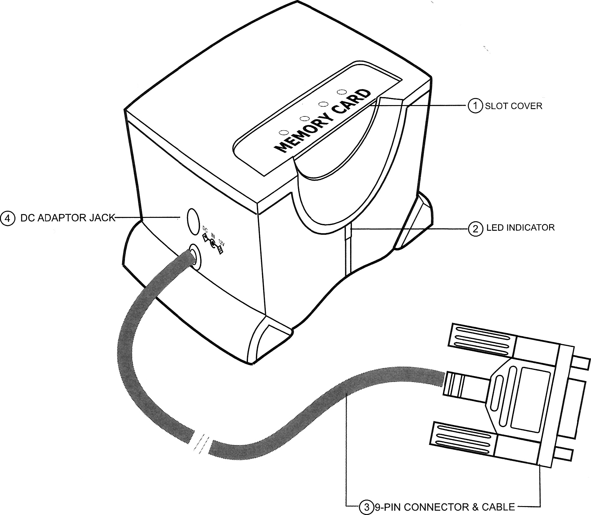
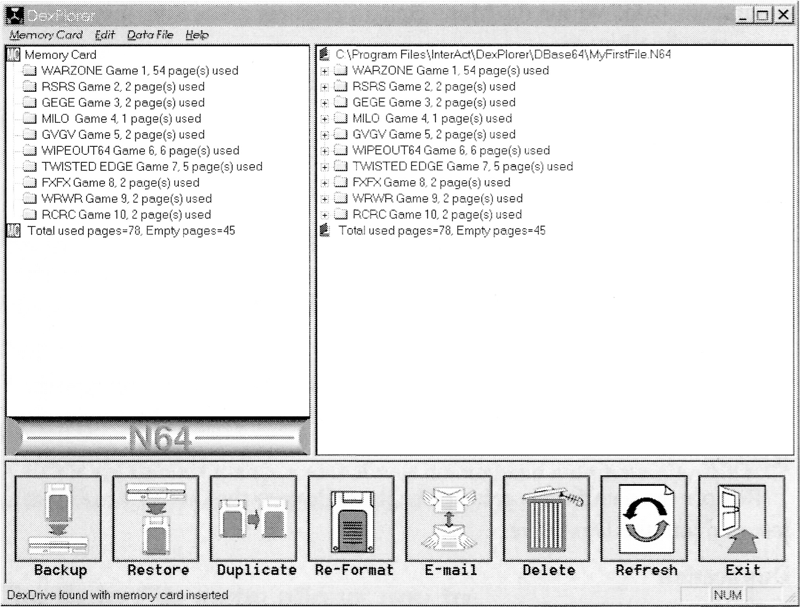

DexDrive
========

http://www.dexchange.net

INTRODUCTION
------------

The DexDrive is a revolutionary device that allows you to copy and store game saves from a **Nintendo 64** memory card to the hard drive of a PC or floppy disk. With help from the DexPlorer software program, the DexDrive also allows you to e-mail game saves to other gamers around the world via the Internet. You can even upload and download saves from the Web! So Spread the Wealth, with the DEXDRIVE.

Your DexDrive package should include the DexDrive, a 12-Volt AC adapter, 2 DexPlorer Software setup diskettes, an instruction manual, a registration card and a warranty card. If you are missing any of these items, please contact InterAct Accessories’ Consumer Services Department at (407) 333-1392. Please take this time to fill out your registration card and mail it to us so that you can receive updates and information about new products from InterAct.

TECHNICAL SPECIFICATIONS
------------------------

### Features

- Operating System supported: Windows 95, Windows 98 and Windows NT 4.0
- Console system supported: Nintendo 64 game system
- Memory cards supported: Nintendo 64 compatible memory cards
- Power Input: DC 12-volt
- Product Descriptions (FIG. 1):
    1.  LED Indicator
    2.  Memory Card Slot
    3.  9-pin Serial Port Connector

---

**FIG. 1**

### System Requirements

- Personal computer with a Pentium 75MHz or higher processor
- Microsoft Windows 95/98 /NT 4.0 operating system
- 8 Megabytes of system RAM
- 2 Megabytes of available hard drive space
- Super VGA with Hi-Color display mode
- System with one available COM port

---

CONNECTING THE DEXDRIVE
-----------------------

***NOTE: This DexDrive package contains a version of the DexPlorer software that is “Dual Compatible”, which means that the software program can read game saves from either the PlayStation or Nintendo 64 DexDrive.***

***This new DexPlorer software will always detect the DexDrive connected into COM/Serial port #1 FIRST. If you have 2 DexDrives connected into COM/Serial ports #1 and #2, you must disconnect the DexDrive from port#l in order for the DexPlorer software to detect the DexDrive in port #2.***

**To connect the DexDrive to your PC:**

1.  Turn off your computer before connecting the DexDrive (without the memory card inserted).
2.  Plug the 9-pin connector of the DexDrive into the 9-pin COM/Serial port on the back of your personal computer.
3.  Insert the 12-volt input adapter into the back of the DexDrive and plug the adapter into an electrical outlet.
4.  Turn on your computer.

***NOTE: You may have to reconfigure the COM/Serial ports on your computer before using the DexDrive.***

INSTALLING THE DEXPLORER SOFTWARE
---------------------------------

***NOTE: Before installing, please READ the "System Requirements" section above.***

### Method 1

1.  Turn on your computer and enter the Windows 95/98/NT 4.0 operation system.
2.  Insert Diskette #1 into your 3.5” floppy disk drive.
3.  Click the Windows Start button and then choose Run.

---

4.  In the Run dialog box, type A:\setup (typically the floppy drive is A:).
5.  Click OK and follow the on-screen instructions to complete the installation.

### Method 2

1.  Turn on your computer and enter Windows 95/98/NT 4.0 operation system.
2.  Insert Diskette #1 into your 3.5” floppy disk drive.
3.  Click the Windows Start button and then choose the Programs icon.
4.  Click the Windows Explorer icon.
5.  In Windows Explorer, select the 3.5” Floppy (A:) icon located in the left display panel.
6.  Double click the Setup.exe icon in the right display panel to begin the setup program.
7.  Follow the on-screen instructions to complete the installation.

RUNNING THE DEXPLORER PROGRAM
-----------------------------

To run the DexPlorer software program, you must:

1.  Click the Windows Start button, then choose the Programs icon.
2.  Select InterAct DexPlorer and then the DexPlorer icon.
3.  When the DexPlorer Window appears, you can start using the DexDrive.

UNDERSTANDING THE DEXPLORER SOFTWARE PROGRAM
--------------------------------------------

***NOTE: This version of the DexPlorer program is “Dual Compatible”, which means that the DexPlorer program can read game saves from both the PlayStation AND the Nintendo 64 DexDrive. Look for future versions of the DexPlorer software at the Official DexDrive website: www.dexchange.net***

---

When you choose the DexPlorer icon, the DexPlorer window will appear (FIG. 2):

**Left Panel**

Shows the icon or folder, and title of the game saves stored on the inserted memory card. This panel will also show you the remaining amount of storage space that is left on the memory card.

**Right Panel**

Shows the content of a selected data file (.GME or .N64), plus the icon or folder, and title of each game save within that data file. This panel will also show you the remaining amount of storage space that is left in the data file.

**Menu Bar**

Contains the Function menus.

---

**Bottom Panel**

The 8 buttons on this panel have the same functions as some of those commands listed within the Menu Bar. To perform a function, just click the corresponding button.

**Status Bar**

Shows the current status of the DexDrive.

**MENU BAR**

The Menu Bar contains the Memory Card, Edit, Data File and Help menus.

### The Memory Card menu allows you to:

**Backup**

Saves all data on a memory card to the hard drive or to a floppy disk. A backup file will automatically be appended with a .GME or .N64 extension.

**Restore**

Restores the data from a selected backup file onto the memory card that is inserted into the DexDrive.

**Duplication**

Duplicates all the game saves from a Source memory card to one or more Target memory cards.

**Re-Format**

Re-Formats and erases your memory cards.

**Refresh**

Rebuilds communication with the COM/Serial port on your PC, and refreshes the left and right display panels.

**E-Mail**

Activates a specified E-mail program.

**Change Page**

Allows the user to change pages on a multi-page memory card.

---

**Exit**

Exits the DexPlorer program.

### The Edit menu allows you to:

**Copy**

Copies selected game saves from either the left or right display panel, and stores these saves in the memory buffer of the DexDrive.

**Paste**

Pastes the copied data from the memory buffer to a folder in either the left or right display panel.

**Delete**

Deletes a selected game save from either the left or right display panel.

**Undelete**

Retrieves the last game save that was deleted and automatically stores it within the display panel from which it was deleted.

### The Data File menu allows you to:

**Select Data File**

This enables the user to select an existing .GME (PlayStation) or .N64 (Nintendo 64) data file located on either the hard drive of a PC or a floppy disk.

**Create new Data File**

This enables the user to create a .GME (PlayStation) or .N64 (Nintendo 64) data file and place it on either the hard drive of a PC or a floppy disk.

***NOTE: The data files that you Create or Select is dependent upon whether the PlayStation or Nintendo 64 DexDrive is connected into COM/Serial port #1.***

---

### The Help menu contains:

**Contents**

Provides an outline of the Help topics contained within the DexPlorer software program.

**Index**

Allows you to view the definition of a specified Help topic.

**About DexPlorer**

Shows the version number of the DexDrive firmware and the DexPlorer software.

**BOTTOM PANEL**

The **Backup, Restore, Duplicate, Re-Format, E-Mail, Delete, Refresh, and Exit** buttons will perform the same functions as those same commands listed under the Memory Card or Edit menus.

### COPYING AND PASTING GAME SAVES

The following methods work for games saves stored on either a memory card or in a data file. You can use either method Two or Three to copy game saves from one data file (.GME or .N64) to another.

#### Method 1

1. **CLICK** on the game save that you want to copy and **DRAG** it into a **Folder** in the opposite display panel. The same game save cannot appear twice in the same display panel.

#### Method 2

1.  **Right click** on the game save that you want to copy.
2.  Choose **Copy**.
3.  A message box will appear. Click **Yes** to continue or **Cancel** to stop the process.
4.  If you choose Yes, a processing bar will appear indicating that the Copy process has started. When the bar disappears, the game save will have been copied and stored in the memory buffer of the DexDrive.

---

5.  **Right click** on a Folder that **IS NOT in the same panel** as the game save that you just copied.
6.  Choose **Paste**.
7.  A message box will appear. Click **Yes** to continue or **Cancel** to stop the process.
8.  If you choose Yes, a processing bar will appear indicating that the Paste process has started. When the bar disappears, the game save will have been pasted onto the display panel that you chose.

#### Method 3

1.  **Click** on the game save that you want to copy.
2.  Click the **Edit** heading on the **Menu Bar**, then choose **Copy**

**OR**

Press these keys on your keyboard simultaneously: **Ctrl+C**.

3.  A message box will appear. Click **Yes** to continue or **Cancel** to stop the process.
4.  If you choose Yes, a processing bar will appear indicating that the Copy process has started. When the bar disappears, the game save will have been copied and stored in the memory buffer of the DexDrive.
5.  Click on a Folder that **IS NOT in the same panel** as the game save that you just copied.
6.  Click the **Edit** heading on the **Menu Bar**, then choose **Paste**

**OR**

Press these keys on your keyboard simultaneously: **Ctrl+V**.

7.  A message box will appear. Click **Yes** to continue or **Cancel** to stop the process.
8.  If you choose Yes, a processing bar will appear indicating that the Paste process has started. When the bar disappears, the game save will have been pasted into the display panel that you chose.

---

### HOW TO DELETE GAMES SAVES

1.  Click the icon or folder of the game save that you want to delete.
2.  Click the **Edit** heading on the **Menu Bar**, then choose **Delete**

**OR**

Click the **Delete** button on the **Bottom Panel**

**OR**

**Right Click** your mouse and then choose **Delete**.
**A Warning Message will appear**

3.  Click **OK** to delete the save or **Cancel** to stop the deletion process.
4.  If you choose OK, a processing bar will appear. When the bar disappears, the deletion process is complete.
5.  Repeat the procedure from **Step 1** if you want to delete another game save.

***NOTE: You cannot stop the deletion process once it has begun, but you can undelete a save.***

### HOW TO UNDELETE GAME SAVES

1.  Immediately after you have deleted a game save, click on the **Edit** heading on the **Menu Bar**, then choose **Undelete**.
2.  The deleted game save will appear in the same display panel from where it was deleted.

***NOTE: If there are no available space within the panel from which the game save was deleted, you will not be able to undelete that save until you allocate space in that display panel to store the save.***

---

### CHANGING PAGES ON A MULTI-PAGE MEMORY CARD

1.  Click the **Memory Card** heading on the **Menu Bar**, then choose **Change Page**.
2.  The following functions are listed in the pull down menu:
    -   Next Page  
        Allows the user to move forward one page on a multi-page memory card.
    -   Previous Page  
        Allows the user to move backward one page on a multi-page memory card.
    -   Fast Forward  
        Allows the user to move forward 10 pages on a multi-page memory card.
    -   Fast Backward  
        Allows the user to move backward 10 pages on a multi-page memory card.
    -   Jump Relative  
        Allows the user to move forward or backward by more than one page relative to the current page.

1.  Insert the number of pages that will be jumped.
2.  Click the Forward or Backward button to move.

### Changing Pages on a Massive Memory Card 1440 (PLAYSTATION MEMORY CARDS ONLY)

The Massive Memory Card 1440 for the PlayStation requires special handling when changing pages with the DexPlorer software.

The user must click this entry before inserting the Massive Memory Card 1440 into the DexDrive memory card slot.

***NOTE: If your multi-page memory card has buttons that are used to change pages, we suggest that you use those buttons to change pages instead of the software.***

---

### DATA FILES

There are 2 types of data files that the DexPlorer program recognizes:

- **PlayStation** data file represented with the **.GME extension**
- **Nintendo 64** data file represented with the **.N64 extension**

#### How to Select a .GME (PlayStation) data file

1.  Make sure your PlayStation DexDrive is plugged into COM/Serial port #1.
2.  Click the **Data File** heading on the **Menu Bar**, then choose **Select .GME File**.
3.  Find the .GME file that you want to open, then click **Open**.
4.  The .GME file that you selected will appear in the Right display panel.

#### How to Create a .GME data file

1.  Make sure your PlayStation DexDrive is plugged into COM/Serial port #1.
2.  Click the **Data File** heading on the **Menu Bar**, then choose **Create .GME File**.
3.  Choose the place that you want to store this new file and name the file using the .GME extension, and then click **Open**.
4.  The .GME file that you created will appear in the Right display panel.

#### How to Select a .N64 (Nintendo 64) data file

1.  Make sure your Nintendo 64 DexDrive is plugged into COM/Serial port #1.
2.  Click the **Data File** heading on the Menu Bar, then choose **Select .N64 File**.
3.  Find the .N64 file that you want to open, then click **Open**.
4.  The .N64 file that you selected will appear in the Right display panel.

---

#### How to Create a .N64 data file

1.  Make sure your Nintendo 64 DexDrive is plugged into COM/Serial port #1.
2.  Click the **Data File** heading on the **Menu Bar**, then choose **Create .N64 File**.
3.  Choose the place that you want to store this new file and name the file using the .N64 extension, and then click **Open**.
4.  The .N64 file that you created will appear in the Right display panel.

#### USING FILE EXPANDERS WITHIN DATA FILES

The "plus signs" that you see beside each game save in a data file (either the .GME or .N64 files) are called File Expanders. This is where you can input your comments about specific game saves. Your message will be displayed in the Right Panel.

##### Using a File Extender

1.  Click on the plus sign by the game save that you want to comment about.
2.  A Document icon will appear. Double click on this icon and a "Notes Editing" dialog box will appear.
3.  Type your message into the box. Your message cannot be longer than 256 characters long.

***NOTE: These File Extender messages can be edited. Just click on the plus sign and double click on the Document icon again, and edit or delete your message. Your message will always appear in that file extender within that data file until you delete or edit the message.***

***NOTE: If you delete or transfer a game save from a data file, the file extender message will always stay in the data file and at the spot where you first created it. But you will never see the file extender message on a memory card.***

---

### HOW TO BACKUP A MEMORY CARD

The DexPlorer program provides an easy way for users to backup all the contents of a memory card:

1.  Click the **Memory Card** heading on the **Menu Bar**, then choose **Backup**, **OR**

Click the **Backup** button on the **Bottom Panel**.
**The Backup Memory Card dialog box will appear.**

2.  Type in the name of the new backup file that you want to create and save onto the hard drive or floppy disk

**OR**

Click the **Browse** button, and the **Select New Game** dialog box will appear. Type in the name of the file that you want to create and save onto the hard drive or floppy disk (If you
select an existing .GME or .N64 file, the warning message "Replace existing file" will appear).

3.  Click the **Start** button to begin the backup process.

***NOTE: You can stop this process at anytime by clicking the Cancel button.***

### HOW TO RESTORE A BACKUP FILE TO A MEMORY CARD

The DexPlorer program can restore the contents of a selected backup file to a memory card:

1.  Click the **Memory Card** heading on the **Menu Bar**, then choose **Restore**

**OR**

Click the **Restore** button on the **Bottom Panel**.
**The Restore Memory Card dialog box will appear.**

---

2.  Type in the name of the data file that you want restored from the hard drive or floppy disk

**OR**

Click the **Browse** button. The **Select New Game** dialog box will appear. Select the data file that you wan restored from the hard drive or floppy disk. Click the **Start** button.

3.  A reconfirm message will appear. Click **OK** to continue or **Cancel** to exit.
4.  The Restore process will begin once the processing bar appears.

***NOTE: You can stop this process at anytime by clicking the Cancel button in the Restore Memory Card dialog box. However, if you do so, the memory card may contain invalid information.***

### HOW TO LAUNCH YOUR E-MAIL PROGRAM

1.  Click the **Memory Card** heading on the **Menu Bar**, then choose **E-Mail**, **OR**

Click the **E-Mail** Button on the **Bottom Panel**.

2.  Specify which particular E-mail program that is to be used in the List Box of “E-Mail client”. For example, you may choose “AOL Ver.4.x” if you have “AOL version 4.x” software installed on your system.
3.  Once you have selected your E-mail program in the List Box, the information in the “Run” Edit Box will be updated automatically to indicate which program is to be executed. If the program fails to input the information about the pathname of your E-mail program, it will enable the **Browse** button and allow you to specify which particular program is to be executed.
4.  Select the “User Defined” entry from the List Box if you do not find an entry that matches your E-mail program. This will also enable the Browse button so that you can insert the pathname of the E-mail program you would like to launch.
5.  Click **Launch** to start the E-mail program. Once the E-mail program is successfully launched, you can then connect to the Internet.

---

### HOW TO REFRESH THE COM/SERIAL PORT

To rebuild communication with the COM/Serial port or refresh the display of the left and right display panels:

1.  Click the **Memory Card** heading on the **Menu Bar**, then choose **Refresh**,

**OR**

Click the **Refresh** icon on the **Bottom Panel**.

### HOW TO USE THE INDEX FUNCTION

The Index provides a quick search feature of the Help topics of different functions within the DexPlorer program. The user can:

1.  Click the **Help** heading on the **Menu Bar**, then choose **Index**,

**OR**

Press the **Shift+F1** keys on your keyboard simultaneously.

2.  The “?” will appear on the screen.
3.  Move the “?” to the area where you require help.
4.  **Click** the left mouse button on that area and the **Help Contents** screen will
    appear.

### HOW TO EXIT THE DEXPLORER PROGRAM

1.  Click the **Memory Card** heading on the **Menu Bar**, then choose **Exit**,

**OR**

Click the **Exit** button the **Bottom Panel**.

2.  Follow the on-screen instructions to exit the program.

### HOW TO UNINSTALL THE DEXPLORER SOFTWARE

1.  You can use the Windows 95/98/NT 4.0 Add/Remove Programs to uninstall the DexPlorer software:
2.  Click the **Start** button in Windows 95/98/NT 4.0.
3.  Select the **Settings** icon then click **Control Panel**.
4.  In the Control Panel Window, double click **Add/Remove Programs** icon.

---

5.  Select **InterAct DexPlorer** and click **Add/Remove** button.
6.  Select **Yes** in the **“Confirm File Deletion”** window.

CARE FOR THE UNIT AND TROUBLESHOOTING
-------------------------------------

The DexDrive is an electronic unit and should be treated with care when handling. InterAct Accessories recommends that you do not disconnect or connect the DexDrive to your Personal Computer when the system is turned ON. We also recommend that you do not store the unit in direct sunlight or at extreme temperatures, or spill any liquids on the unit. Finally, do not open the DexDrive casing. Service and maintenance should only be done by InterAct Accessories.

If you are having difficulty with your DexDrive, please contact InterAct Accessories by the following means:

    Phone           : (407) 333-1392
                      Monday through Friday, 9:00am to 5:00pm EST
    E-mail          : dexsupport@interact-acc.com
    World Wide Web  : http://www.dexchange.net
    Mailing Address : InterAct Accessories
                      ATTN: Customer Service
                            2950 Lake Emma Road
                            Lake Mary, FL 32746

***NOTE: Please call Customer Service before mailing any product to them.***

PlayStation™ is a registered trademark of Sony Computer Entertainment Inc.
Nintendo 64™ is a registered trademark of Nintendo of America Inc.

---

WARRANTY
--------

InterAct Accessories, Inc. warrants to the original purchaser of the ***DexDrive***™ for the Nintendo™ that it will be free from defects in material and/or workmanship for a 90-day period from the date of purchase. If the ***DexDrive***™ is discovered to be defective within this warranty period, InterAct Accessories, Inc. at its option will repair or replace, at no charge, any part that InterAct Accessories. Inc. determines to be defective.

To obtain warranty services during the warranty period, send the ***DexDrive***™ postage pre-paid, with a check or money order for $5.00 to cover return postage and handing, along with proof and date of purchase to **InterAct Accessories, Inc.** 2950 Lake Emma Road, Lake Mary, FL 32746

This warranty is limited to the internal works of the ***DexDrive***™ and the external housing. It does not cover normal wear and tear, abuse or misuse.

Repair or replacement as provided under this warranty is InterAct Accessories, Inc.’s exclusive prerogative. InterAct Accessories, Inc. shall not be held liable or any incidental or consequential damages for breach of any express or implied warranty on the ***DexDrive***™ except to the extent prohibited by applicable law, and any implied warranty of proper operation is limited in duration to the duration of this warranty.

---

Printed in Hong Kong

---

ADDENDUM
========

Since production, we have made some modifications to the N64 DexDrive® manual. Please note the following changes that will be added to certain pages of this manual.

INSTALLING THE DEXPLORER SOFTWARE
---------------------------------

### Method 3

***NOTE: Use this method ONLY IF you have the PlayStation® DexPlorer software program (versions 1.00.935 and higher) already installed onto your PC.***

1.  Click the Windows® Start button and choose Programs.
2.  Highlight InterAct DexPlorer then highlight the Uninstaller icon.
3.  Follow the on screen instructions to delete the PlayStation® version of the DexPlorer program from your PC.
4.  Now choose either Installation Method listed above and follow the instructions to install this Dual Compatible DexPlorer program.

HOW TO REFORMAT A MEMORY CARD
-----------------------------

1.  Click the **Memory Card** heading on the **Menu Bar**, then choose **Re-Format**,

**OR**

Click the **Re-Format** button on the **Bottom Panel**.
**The Re-Format Memory Card dialog will appear.**

2.  Click the **Start** button in the **Re-Format Memory Card** dialog box. The message box will appear asking if you are sure that you want to proceed.
3.  Press **OK** to start reformating or **Cancel** to stop the reformat process. A processing bar will appear.
4.  When the processing bar disappears, the card is reformated.

***NOTE: You cannot stop the re-format process after you have pressed OK.***

---

HOW TO DUPLICATE A MEMORY CARD
------------------------------

The following procedures describe how to duplicate the contents of a memory card to one or more memory cards:

1.  Click the **Memory Card** heading on the **Menu Bar**, then choose **Duplicate**, **OR**

Click the **Duplicate** button on the **Bottom Panel**.
**The Duplicate Memory Card dialog box will appear.**

2.  Insert the memory card that you want to copy into the DexDrive™. This is the Source memory card.
3.  Click the **Start** button. A processing bar will appear to indicate that the reading process has started.
4.  Wait until the reading process is completed. Another dialog box will appear requesting that the Target memory card be inserted into the DexDrive™. This is the memory card that you want to place the copied data onto.
5.  Take out the Source memory card and insert the Target memory card.
6.  Click the **Start** button. If there is data already stored on the Target memory card, a message box will appear stating that **“The Target memory card contains some game saves”**. Click **OK** to overwrite these saves or **Cancel** to abort the process.
7.  If you choose OK, another processing bar will appear to indicate that the writing process has started.
8.  When the process is finished, another dialog box will appear telling you that the card has been duplicated.
9.  Repeat the procedure from **Step 6** if you want to duplicate the contents onto another Target memory card.

_NOTE: You can stop the duplication processing at any time by clicking the Cancel button in the Duplicate Memory Card dialog box._
